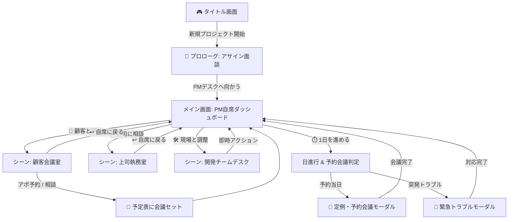

# 🕹️ ADV風コマンド選択式 Web UI 仕様書 (ADV UI Spec)

## 1. コンセプトと設計方針
* **アドベンチャーゲーム（ADV）体験の提供**:
  * 固定された一貫性のあるレイアウト（ステータス表示 / 状況ビジュアルビュー / メッセージダイアログ / コマンド操作パネル）を採用。
  * メニューの「階層をたどる」操作感を排除し、**「場所・相手の元へ移動して会話・行動する（イマーシブ遷移）」**直感的なUI構造を実現。
* **画面役割の分離と視覚的強調**:
  * **🖼️ SITUATION VIEW (中央)**: 状況イメージ（背景・キャラクター）の視覚的ディスプレイ（表示用/ポインター無効）。
  * **🎮 COMMAND PANEL (下部)**: 明確なネオン枠とコントロールヘッダーを持つ操作パネル。コマンド選択目線のすぐ横に **`⚡ 本日の残AP`** を表示。
* **日単位進行 ＆ リアリティあるアポ・スケジューリングシステム**:
  * 4週間の納期を **全 20 営業日（Day 1 〜 Day 20）** の日単位ターンで表現。
  * 即時実行できる現場アクションと、相手の都合による**数日後の会議予約（スケジューリング）**を分離し、逆算の計画性と前準備の重要性をゲーム性として表現。

---

## 2. 画面レイアウトと画面遷移構造

### 2.1 メイン画面 (PM自席 / ダッシュボード)
* **⚡ 自由コマンド選択仕様**:
  * 1日の中でのAP制限を撤廃。プレイヤーは行動ポイントを気にすることなく、何度でも自由に必要なアジェンダ調整や現場アクションを実行可能。
  * アクション実行後、プレイヤーが「本日を終了する」と判断した時点で `⏱️ 1日を進める` ボタンを押して次の日へ進行する。
* **📌 ハイブリッド予約UI (常時表示 ＋ 全件ポップアップ参照)**:
  * ステータスバー日付行右側に `📌 次の予定: Day X (あと N日) 【議題名】` を常時表示し、画面を見た瞬間に直近目標を把握可能。
  * 該当バッジをクリックすると `📅 予約中の会議・アポ一覧` モーダルが開き、日程の近い順に全アポの開催日・残り日数・アジェンダを一覧参照可能。
* **ボタン（第一階層）**:
  1. `💬 顧客との会議調整` (顧客の会議室・アポ調整シーンへ遷移)
  2. `🏢 上司に相談・報告` (上司の執務室・進捗報告シーンへ遷移)
  3. `🛠️ 現場へ行く (開発フロア)` (開発チームフロア・即時アクションシーンへ遷移)
  4. `⏱️ 1日を進める` (日進行判定・アポ会議実行処理)

### 2.2 シーン画面 (対話・実行画面)

#### 顧客会議室 (`💬 顧客と話す`)
* **即時 / 予約アクション**:
  * `📅 要件定義WSのアポを取る (2日後)` *(アポ予約)*
  * `👥 段階リリースの交渉アポを取る (3日後)` *(アポ予約)*
  * `📱 プロトタイプを見せる (即時)`
  * `🤝 QCD優先順位の合意アポを取る (1日後)` *(アポ予約)*
  * `↩ 自席に戻る`

#### 上司執務室 (`🏢 上司に相談`)
* **即時 / 予約アクション**:
  * `📅 納期バッファ直訴の面談アポを取る (1日後)` *(アポ予約)*
  * `🙋‍♂️ 助っ人要請の面談アポを取る (1日後)` *(アポ予約)*
  * `❓ 上司のリスク許容範囲確認 (即時/無料)`
  * `↩ 自席に戻る`

#### 開発チームフロア (`🛠️ 現場と調整`)
* **キックオフ前後の画面・メッセージ状態**:
  * **キックオフ未完了時**:
    * 表示キャラ名: `開発メンバー候補`
    * メッセージ: `「PMさん、開発チームフロアへようこそ！ 今回の改修案件ですね。まずはキックオフで役割分担（PL決定）と開発方針を固めましょう！」`
    * 選択可能アクション: `🚀 チームキックオフ・役割分担の整理`, `🛠️ 技術リスク・見積精査`
  * **キックオフ完了時 (`team_kickoff` 実行後)**:
    * 表示キャラ名: `開発リーダー(PL) & チーム`
    * 完了直後ダイアログ: `「PMさん、キックオフの開催ありがとうございます！ 役割分担と基本方針がクリアになりました。私（PL）を中心に現場一丸となって開発を進めます！」`
    * 通常時メッセージ: `「PMさん！ 現場の技術リスク精査や1on1なら今日すぐに動けますよ！」`
    * 選択可能アクション: `🚨 現場チームに休日出勤を依頼する`, `🛠️ 技術リスク・見積精査`, `📚 過去の失敗教訓共有`, `❓ チームの懸念点1on1`
* **即時アクション**:
  * 各アクション実行時、ログ追加とともに画面中央の会話ダイアログ枠に現場からのレスポンスメッセージが即座に反映される。
  * `↩ 自席に戻る`

---

## 3. アポ・スケジューリング ＆ イベントシステム

### 3.1 📅 アポ予約と事前準備（逆算プレイ）
* 顧客や上司との重要な交渉・ワークショップは、打診した**数日後（1〜3日後）の予定表**に会議がセットされます。
* 会議当日までの待ち期間を利用して、現場で `技術リスク精査` などの根拠を整えておくことで、会議当日の成功率やコンボ（根拠ある交渉）が発動します。

### 3.2 👥 定期イベント ＆ 予約会議
* **週次定例会議**: 毎週末（Day 5, Day 10, Day 15, Day 20）の開始時に自動発生。
* **予約会議**: アポ日に到達した時点で朝一番に会議モーダルが起動。

### 3.3 🚨 突発・緊急イベント
* チーム士気低下や特定リスク到達時に、日の開始時に緊急トラブルが割り込み発生。

---

## 4. UI状態管理・データ構造方針 (フロントエンド)

* **UI Mode (画面状態)**:
  * `'TITLE'`: タイトル画面
  * `'PROLOGUE'`: 上司からのアサイン対話シーン
  * `'DASHBOARD'`: メイン画面（第一階層ボタン4つを表示）
  * `'SCENE_CUSTOMER'`: 顧客会議室シーン
  * `'SCENE_MANAGER'`: 上司室シーン
  * `'SCENE_TEAM'`: 現場フロアシーン
  * `'EVENT_MODAL'`: イベント・予約会議モーダル進行中
* **Schedule State (予定表データ)**:
  * `scheduledMeetings`: `[{ day: 5, actionId: "phased_release", title: "顧客と段階リリース交渉" }]`
