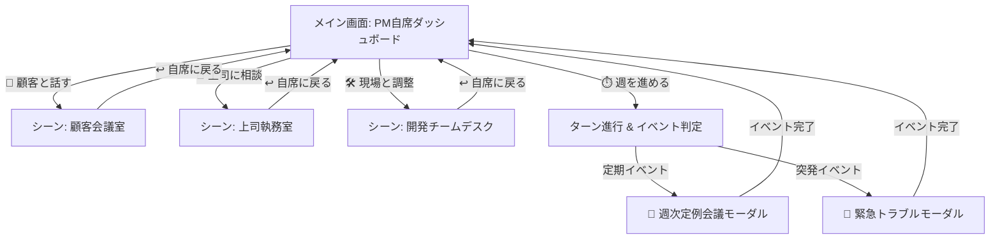

# 🕹️ ADV風コマンド選択式 Web UI 仕様書 (ADV UI Spec)

## 1. コンセプトと設計方針
* **アドベンチャーゲーム（ADV）体験の提供**:
  * 固定された一貫性のあるレイアウト（ステータス表示 / メッセージダイアログ / アクションパネル）を採用。
  * メニューの「階層をたどる」操作感を排除し、**「場所・相手の元へ移動して会話・行動する（イマーシブ遷移）」**直感的なUI構造を実現。

---

## 2. 画面レイアウトと画面遷移構造

### 2.1 メイン画面 (PM自席 / ダッシュボード)
* **概要**: PMの自席画面。プロジェクト全体ステータス（進捗、予算、士気など）が可視化され、次の行動（移動）を選択する。
* **ボタン（第一階層）**:
  1. `💬 顧客と話す` (顧客の会議室シーンへ遷移)
  2. `🏢 上司に相談` (上司の執務室シーンへ遷移)
  3. `🛠️ 現場と調整` (開発チームフロアシーンへ遷移)
  4. `⏱️ 週を進める` (ターン経過判定・イベント処理を実行)

### 2.2 シーン画面 (対話・実行画面)
各場所へ移動すると、背景画像・立ち絵・メッセージダイアログが切り替わり、**その場所・相手に対して実行できる具体アクション**が表示されます。

#### 顧客会議室 (`💬 顧客と話す`)
* **セリフ・雰囲気**: 「やあPMさん！ 今週の進捗はどうですか？」
* **具体アクション**:
  * `💡 要件定義WSを開く (AP 1)`
  * `👥 段階リリースを提案する (AP 1)`
  * `📱 プロトタイプを見せる (AP 1)`
  * `🤝 QCD優先順位の合意 (AP 1)`
  * `↩ 自席に戻る`

#### 上司執務室 (`🏢 上司に相談`)
* **セリフ・雰囲気**: 「何か問題でも起きたか？ 報告を聞こう」
* **具体アクション**:
  * `🏢 納期バッファの直訴 (AP 1)`
  * `🙋‍♂️ 助っ人アサイン要請 (AP 1)`
  * `❓ 上司のリスク容許範囲確認 (AP 0)`
  * `↩ 自席に戻る`

#### 開発チームフロア (`🛠️ 現場と調整`)
* **セリフ・雰囲気**: 「PMさん、開発の進捗や設計について相談ですか？」
* **具体アクション**:
  * `🛠️ 技術リスク・見積精査 (AP 1)`
  * `📚 過去の失敗教訓共有 (AP 1)`
  * `❓ チームの懸念点1on1 (AP 0)`
  * `↩ 自席に戻る`

---

## 3. イベント発生メカニズム (ハイブリッド型)

イベントは**【定期イベント】**と**【突発イベント】**の2つの契機で発生します。

### 3.1 👥 定期イベント（週次定例会議）
* **発生タイミング**: プレイヤーが `⏱️ 週を進める` を押した直後、新しい週の開始時に自動発生。
* **内容**:
  * 先週の進捗報告、成果物の共有。
  * 顧客の非可視タイプ（こだわり型/丸投げ型/納期絶対型）の伏線セリフや、仕様変更の新たな打診。
* **画面挙動**: コマンドパネルが隠れ、「イベント会話 ＋ イベント選択肢」が表示される。

### 3.2 🚨 突発・緊急イベント
* **発生タイミング**: ターン進行時、またはチーム士気低下/リスク度上昇時にランダムまたは条件満たしで割り込み発生。
* **内容**: バグ発覚、キーマンの体調不良、顧客からの緊急電凸など。
* **画面挙動**: 画面全体に緊急警告演出（ポップアップ/モーダル）が差し込まれ、対応選択肢を選んで対処する。

---

## 4. UI状態管理・データ構造方針 (フロントエンド)

* **UI Mode (画面状態)**:
  * `'DASHBOARD'`: メイン画面（第一階層ボタン4つを表示）
  * `'SCENE_CUSTOMER'`: 顧客会議室シーン
  * `'SCENE_MANAGER'`: 上司室シーン
  * `'SCENE_TEAM'`: 現場フロアシーン
  * `'EVENT_MODAL'`: イベント進行中（通常コマンドロック）
* **コンポーネント構成**:
  * `Header`: プロジェクト全体の各種メータ表示（予算/納期/品質/士気/AP）
  * `MainView`: 背景・キャラ立ち絵・メッセージダイアログ
  * `ActionPanel`: 現在の `UI Mode` に応じたアクションボタン群の動的描画
