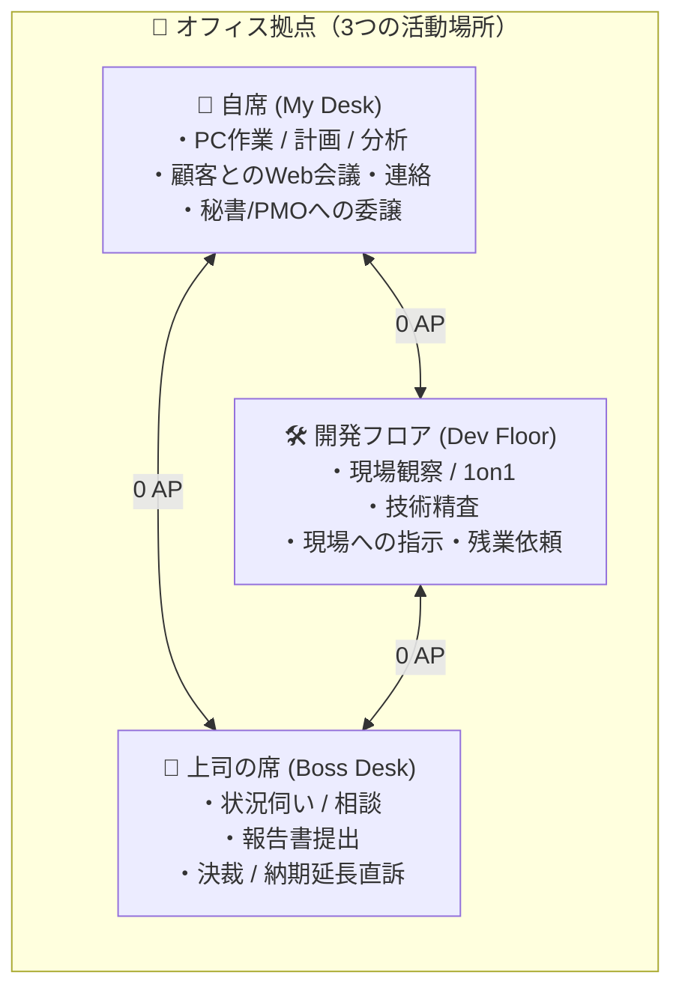

# 🕹️ 新コマンド体系・サブコマンド仕様書 (Command System Spec)

本ドキュメントは、PMシミュレーターにおける「大分類固定コマンド（移動・会話・作業・依頼・日程）」および、場所・状況・フェーズに応じて動的に変化する「サブコマンド」の全仕様・パラメータ・トレードオフをまとめた設計仕様書です。

---

## 1. コマンドシステムの基本設計方針

### 1.1 大分類（メインコマンド）の常時固定
画面下部のコマンドパネルには、常に以下の 5 つの大分類が固定表示されます。
プレイヤーはまず大分類を選択し、展開されたサブコマンドから実行したいアクションを選びます。

| メインコマンド | アイコン | 役割とコンセプト |
| :--- | :---: | :--- |
| **🚶 移動 (MOVE)** | `🚶` | 活動拠点を切り替える（自席 / 開発フロア / 上司の席） |
| **💬 会話 (TALK)** | `💬` | メンバーや上司、隣の秘書/PMO、顧客との対話・ヒアリング・助言要請 |
| **📝 作業 (WORK)** | `📝` | PM自身のデスクワーク・分析・資料作成・Web会議交渉（武器を作る） |
| **📢 依頼 (ORDER)** | `📢` | チームへの作業指示、秘書/PMOへの調整代行、上司への決裁・納期直訴 |
| **⏱️ 日程 (SCHEDULE)** | `⏱️` | 1日を終了して翌日へ進める / 予定表・予約アポの確認 |

### 1.2 コスト・リソースルール
* **1日あたりのAP**: 毎朝 **3 AP** を支給。
* **🚶 移動**: **0 AP (無料)**（フロア内の移動自体にペナルティは設けず、観察・探索の自由度を保証）
* **💬 会話 / 📝 作業 / 📢 依頼**: 原則 **1 AP**（一部の軽い雑談・ヒアリング・助言相談は **0 AP**）
* **事前準備 ＆ コンボ（因果関係）**:
  * 自席で「作業（準備）」を完了させておくと、開発現場や上司との「会話・依頼」の成功率が跳ね上がったり、専用コマンドが出現する。
  * 自席の「秘書 / PMO」を活用することで、アポ調整や事務作業の負荷（AP）を委譲・軽減できる。

---

## 2. 拠点別サブコマンド一覧（詳細カタログ）

---

### 2.1 🏢 自席 (My Desk) — 司令塔・計画と顧客コミュニケーション
自席はプロジェクト全体のダッシュボードを確認し、頭脳労働（計画・分析・根回し準備）を行うホームグラウンドです。
隣には **秘書 / PMO（アシスタント）** が常駐しており、調整代行や事務作業の委譲、アドバイスを受けることができます。
また、顧客とのチャット・メール・Web会議も自席から行います。

| 大分類 | サブコマンド名 | ID | AP | 種別 | 解放条件 / 出現フェーズ | 主な効果・トレードオフ・フレーバー |
| :--- | :--- | :--- | :---: | :---: | :--- | :--- |
| **🚶 移動** | 🛠️ 開発フロアへ行く | `goto_dev` | 0 | 即時 | 常時 | 開発チームの島へ移動する。 |
| **🚶 移動** | 👔 上司の席へ行く | `goto_boss` | 0 | 即時 | 常時 | 上司（部長・マネージャー）の席へ移動する。 |
| **💬 会話** | 💡 秘書/PMOに助言を求める | `desk_talk_pmo_advice` | 0 | 即時 | 常時 (無料) | 現状のプロジェクト健全度や次に打つべき手のヒント・助言を聞く。 |
| **💬 会話** | 📞 内線で上司に状況伺い | `desk_call_boss` | 0 | 即時 | 常時 (無料) | 上司の機嫌やリスク許容度（許される遅延日数等）を席にいながら確認。 |
| **💬 会話** | 📧 顧客にチャット/メールで近況確認 | `desk_mail_client` | 0 | 即時 | 常時 (無料) | 顧客の現在の関心事や温度感を把握。信頼度微増。 |
| **📝 作業** | 📋 WBS・計画の策定 | `work_wbs_plan` | 1 | 即時 | 初期（キックオフ前） | スケジュール見通しが立ち、プロジェクトの「計画精度フラグ」を獲得。 |
| **📝 作業** | 📱 プロトタイプの作成・準備 | `work_make_prototype` | 1 | 即時 | 常時 | 顧客に見せる動くモックを作成。「プロトタイプ所持フラグ」を獲得。 |
| **📝 作業** | 💻 顧客とWeb会議（要件・QCD交渉） | `work_web_meeting_client` | 1 | 即時 / アポ | 常時 | 顧客とオンラインで要件やQCD優先度をすり合わせる。プロトタイプがあると効果増大。 |
| **📝 作業** | 📊 進捗・バーンダウン分析 | `work_burn_down` | 1 | 即時 | 中盤以降（開発中） | 隠れたタスク遅延やバグ残数を早期検知し、見通し精度を更新。 |
| **📝 作業** | 📑 納品前チェックリスト作成 | `work_check_list` | 1 | 即時 | 終盤（Day 15〜） | リリース直前の抜け漏れリスクを激減させ、受入テスト成功率を向上。 |
| **📢 依頼** | 📅 秘書/PMOに会議の調整代行を依頼 | `order_pmo_schedule` | 1 | 📅 アポ | 常時 | 顧客や上司との重要会議・ワークショップの日程調整を代行させる（確実にアポ成立）。 |
| **📢 依頼** | 📝 秘書/PMOに週次報告のまとめを依頼 | `order_pmo_summary` | 1 | 即時 | 開発中 | 進捗データの集計・ドラフト作成を委譲（PMのデスクワーク時間を節約）。 |
| **📢 依頼** | 🙋‍♂️ 他部署へ応援要請の稟議 | `order_call_reinforce` | 1 | 📅 アポ | リスク高/遅延時 | 2日後に助っ人エンジニア1名が参画。ただし社内政治コスト（上司信頼度 -5）が発生。 |
| **📢 依頼** | 📦 外部ライブラリ・SaaS導入申請 | `order_buy_tool` | 1 | 📅 アポ | 開発フェーズ | 翌日に開発ツールが導入され、チームの開発速度が永続的に +15% 向上（予算消費）。 |
| **📢 依頼** | 📋 顧客受入テスト(UAT)の準備要請 | `order_client_uat_prep` | 1 | 📅 アポ (3日後) | 終盤 | 顧客側に受入体制を作らせる。納品直前の受入遅延トラブルを防止。 |

---

### 2.2 🛠️ 開発フロア (Dev Floor) — 現場の把握・チームマネジメント
エンジニアやデザイナーが集まる開発現場です。士気の維持、技術的課題の把握、現場への作業依頼を行います。

| 大分類 | サブコマンド名 | ID | AP | 種別 | 解放条件 / 出現フェーズ | 主な効果・トレードオフ・フレーバー |
| :--- | :--- | :--- | :---: | :---: | :--- | :--- |
| **🚶 移動** | 🏢 自席に戻る | `goto_desk` | 0 | 即時 | 常時 | 自席のダッシュボードへ戻る。 |
| **🚶 移動** | 👔 上司の席へ行く | `goto_boss` | 0 | 即時 | 常時 | 上司の席へ移動する。 |
| **💬 会話** | 🚀 チームキックオフ（方針宣言） | `talk_kickoff` | 1 | 即時 | **キックオフ前のみ** | チーム発足。PLを任命し、開発本番フェーズへ移行。WBS作成済みだとチーム士気 +20。 |
| **💬 会話** | ❓ メンバーと1on1（懸念ヒアリング） | `talk_1on1` | 0 | 即時 | 常時 (無料) | メンバーの隠れた不満・技術的懸念を看破。個別士気が微回復。 |
| **💬 会話** | 📚 過去の失敗教訓を共有 | `talk_share_lesson` | 1 | 即時 | 常時 | 類似案件のバグ事例を共有し、今後の「バグ発生率」を抑制。 |
| **💬 会話** | 🍕 差し入れ（お菓子・ピザ）をする | `talk_treat_snack` | 0 | 即時 | 開発中 (1日1回) | チーム士気 +10、疲労度 -5%。（自腹予算が少し減るフレーバー） |
| **📝 作業** | 🛠️ コード・見積の技術精査 | `work_tech_audit` | 1 | 即時 | 常時 | 現場のコードや工数見積を一緒に精査。「技術的根拠フラグ」を獲得（上司・顧客交渉で必須）。 |
| **📝 作業** | 🗂️ バックログ・タスクの棚卸し | `work_backlog_refine` | 1 | 即時 | 開発中 | 優先度の低いタスクを整理・明確化。現場の作業迷いが減り、生産性 +10%。 |
| **📢 依頼** | 🚨 現場に休日出勤・残業を依頼 | `order_overtime` | 1 | 即時 | 開発フェーズ | その日の進捗が 1.5倍〜2倍 に激増。ただし【チーム疲労度 +25% & 士気低下】の強い代償。 |
| **📢 依頼** | 🧹 リファクタリング（技術的負債解消）を指示 | `order_refactor` | 1 | 即時 | 開発フェーズ | 当日の開発進捗は一時停止するが、コード品質が大幅向上し、今後のバグ率が激減。 |
| **📢 依頼** | 🔍 コードレビュー基準の厳格化 | `order_strict_review` | 1 | 即時 | 開発フェーズ | 品質が安定するが、デイリーの進捗速度が -15% 低下するトレードオフ。 |

---

### 2.3 👔 上司の席 (Boss Desk) — エスカレーション・経営防衛
直属の上司（部長・マネージャー）の席です。手に負えないトラブルの相談や、納期・リソースの決裁・エスカレーションを行います。

| 大分類 | サブコマンド名 | ID | AP | 種別 | 解放条件 / 出現フェーズ | 主な効果・トレードオフ・フレーバー |
| :--- | :--- | :--- | :---: | :---: | :--- | :--- |
| **🚶 移動** | 🏢 自席に戻る | `goto_desk` | 0 | 即時 | 常時 | 自席へ戻る。 |
| **🚶 移動** | 🛠️ 開発フロアへ行く | `goto_dev` | 0 | 即時 | 常時 | 現場へ向かう。 |
| **💬 会話** | ❓ 上司のリスク許容度を確認 | `talk_boss_tolerance` | 0 | 即時 | 常時 (無料) | 「今回は納期絶対か、予算枠が優先か」などの経営目線の評価軸を確認。 |
| **💬 会話** | ☕ 上司とカジュアル相談・根回し | `talk_boss_chat` | 0 | 即時 | 常時 (無料) | 深刻化する前に事前ジャブを打っておく。上司の警戒感を和らげる。 |
| **📝 作業** | 📊 状況報告レポートを提出 | `work_submit_report` | 1 | 即時 | 常時 | まとめた進捗報告書を提出。上司の安心感・社内評価 +10。 |
| **📢 依頼** | 📅 納期バッファ延長の直訴 | `order_buffer_extend` | 1 | 📅 アポ (翌日) | 遅延リスク時 | 納期を数日延長してもらう直訴。技術的根拠がないと却下される。評価 -10。 |
| **📢 依頼** | 🙋‍♂️ エース級エンジニアの緊急アサイン | `order_ace_engineer` | 1 | 📅 アポ (翌日) | 炎上時 | 圧倒的な生産性を持つエースが助太刀。ただし社内評価ペナルティ大。 |

---

## 3. ⏱️ 日程 (SCHEDULE) メインコマンド

「日程」を選択した場合は、サブコマンドではなく、以下のダッシュボード/進行アクションが実行できます。

1. **⏱️ 本日の業務を終了する (1日を進める)**
   * 本日を終えて翌朝へ進めます。
   * AP全回復、スプリント開発の自動進捗計算、予約アポ・定例会議の発生判定。
2. **📅 予定表・アポ一覧の確認**
   * 現在予約されている会議（「2日後：要件定義WS」「明日：上司面談」など）の一覧とアジェンダを確認。
3. **📊 プロジェクト詳細状況（バーンダウン・詳細ステータス）の確認**

---

## 4. コマンド設計のキモとなる「ゲーム的メカニクス（ジレンマ）」

### ①「作業（準備）」が「会話・依頼」の成否を分ける
* 例：**技術見積精査（現場での作業）** をやっていない状態で、上司に **納期延長（依頼）** をしても「根拠が曖昧だ」と突っぱねられる。
* 例：自席で **プロトタイプ作成（作業）** をしておくと、顧客との **Web会議（交渉）** で選択肢「モック実演」が解禁され、合意率が劇的に跳ね上がる。

### ② 秘書 / PMO を活用した「マネジメントと委譲のレバレッジ」
* PMがすべてを1人で抱え込むと AP が枯渇する。
* 秘書/PMOに日程調整や報告サマリーを委譲（依頼）することで、PMは現場での1on1や技術精査、顧客交渉といったコア業務に集中できる。

### ③「依頼」は進捗を生むが、信頼・士気を削る「諸刃の剣」
* 例：**休日出勤依頼** は遅延を一発で取り戻せる最強コマンドだが、連発するとメンバーが離脱・バーンアウトする。
* 例：上司への **助っ人要請・納期直訴** はリスクを回避できるが、社内評価（PM人事査定）が下がる。

### ④ 場所移動（0 AP）による「現場主義」体験
* 自席でパソコンを叩いているだけでは分からない「メンバーの隠れた不満」が、開発フロアに足を運んで 1on1 することで初めて見えてくる。

---
