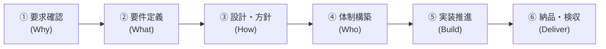
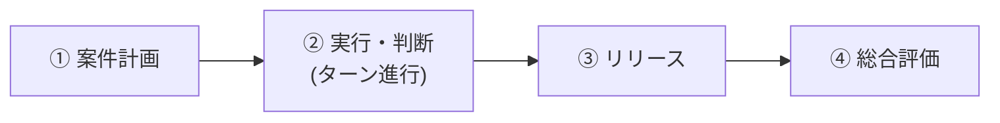

# PM Simulator v2 - ゲームデザイン・全体概要

## 🎯 開発の背景と目的（Why）
**「正しいプロジェクトマネジメント（PM）の役割と段取りを理解していない人（新人PM・非エンジニアPM・マネージャー候補等）に、王道の進め方の重要性と効果を実体験してもらうこと」**

ソフトウェア開発の現場では、「何を作るか決まる前に人を集めてしまう」「設計や方針を決めずに手を動かさせてしまう」「合意相手を間違えて後からちゃぶ台返しを食らう」といったアンチパターンによる炎上が後を絶ちません。
本ゲームは、専門知識（プログラミングや難解なIT用語）がなくても直感的に遊べる平易な言葉で、**「教科書通りの正しい順序とステークホルダーマネジメントを行うことでプロジェクトが驚くほどスムーズに成功する達成感」** と、**「段取りや合意形成を怠った結果として発生するリアルな手戻りの恐ろしさ」** を体験的に学ぶシミュレーションゲームです。

---

## 📌 コア体験・目指す面白さ

### 1. 「王道の段取り（ベストプラクティス）」による成功の再現性
* 焦らず正しい順序で前提条件（土台）を整えることで、後半の実装・テストが手戻りなく爆速かつ高品質に進む気持ちよさを実感できる。

### 2. 「専門知識不要」で直感的に状況がわかる仕組み
* 「アーキテクチャ」「API」「非機能要件」などの専門用語を使わず、「全体の骨組み」「やり取りのルール」といった誰もが直感的に理解できるビジネス表現で状況を可視化。

### 3. 「PL（現場リーダー）との相談」を通じた人間的な状況判断
* 単なるパーセンテージ（数字）を見るだけでなく、現場リーダー（PL）との会話や相談を通じて「今どこまで決まっていて、何が未定か」の肌感覚を掴んで次の手を判断する。

### 4. 「ステークホルダーのキーマン見極めと合意形成」
* 現場担当者だけでなく、「最終決裁者（部長・役員）」や「セキュリティ責任者（情シス）」を特定し、適切なタイミングで合意を取り付ける重要性を体験（ちゃぶ台返しトラップの防止）。

### 5. 「自由な意思決定（フェーズ非固定）」による自発的な判断と学び
* システムが「今は〇〇フェーズ」と強制・制限せず、**常にすべてのPMコマンドが選択可能**。
* プレイヤーが自ら段取りを考えて進めるからこそ、「急いで実装指示を出して大失敗する」というアンチパターンの納得感ある失敗と学びが生まれる。

---

## 📖 専門用語を使わない「平易な表現」対応表

プレイヤーが直感的に判断できるよう、ゲーム内では難解なIT用語を以下のように身近な言葉へ置き換えて表現します。

| 専門用語（IT/開発） | ゲーム内の平易な表現 | 意味・役割（なぜ大切か） |
| :--- | :--- | :--- |
| **アーキテクチャ** | **全体の骨組み・土台** | これがないと建物でいう「柱」がなく、あとから全体が崩壊する |
| **共通スキーマ / API** | **やり取りのルール（約束事）** | メンバー間のデータ受渡ルール。これがないと結合時に大コンフリクト |
| **スコープ定義** | **今回作るものリスト** | やる事・やらない事の境界線。曖昧だと無限に作業が増える |
| **非機能要件** | **安全性・スピード・耐久性** | セキュリティや処理速度。後回しにするとリリース直前でNGが出る |
| **受入基準 / 検収** | **完成のチェック基準** | 顧客が「これでOK」と認める条件。事前に握らないと合格が出ない |

---

## 📐 PMの標準意思決定ステップ（王道プロセス）



| ステップ | 正しいPMの行動（ベストプラクティス） | 段取りを飛ばした時のアンチパターン ＆ 失敗結果 |
| :--- | :--- | :--- |
| **① 要求確認 ＆<br/>キーマン特定** | なぜ作るのか目的を明確化し、**現場担当者だけでなく最終決裁者（部長等）とも合意**する | 現場担当者とだけ握って進め、納品直前に決裁者から「こんなの承認していない」とちゃぶ台返し |
| **② 要件定義 ＆<br/>作るもの確定** | 「今回作るものリスト」と完成基準を決め、セキュリティ等のルールも確認 | 作るものが曖昧なまま人をアサインしてコスト浪費、あるいはセキュリティNGで差し戻し |
| **③ 設計・方針** | 「全体の骨組み」と「やり取りのルール（約束事）」を決める | 設計なしで各自が実装を始め、組み合わせる段階でデータ不整合と衝突（コンフリクト）が爆発 |
| **④ 体制構築** | 各自の得意分野に応じた役割分担とチームの基本ルールを決める | 役割が不明確で責任のなすり合い、特定メンバーへの作業偏重が発生 |
| **⑤ 実装推進** | メンバーが集中できる環境を作り、困りごと（ブロッカー）を解消 | 無理な残業や割り込み指示でモチベーション低下・ミス多発・離職 |
| **⑥ テスト・納品**| 完成のチェック基準に沿って品質検証を行い、スムーズに検収を受ける | チェック基準がなくリリース直前に致命的欠陥が多発して納期遅延 |

---

## 👥 登場人物モデル（ステークホルダー ＆ チーム）

### 🏢 顧客側ステークホルダー
* 👤 **現場担当者（佐藤さん）**: 現場業務に詳しい。打ち合わせしやすいが、最終決定権はない。
* 👔 **最終決裁者・部長（田中部長）**: 多忙で捕まりにくいが、最終決定権（ちゃぶ台返し権限）を持つ。
* 🛡️ **情シス・セキュリティ（鈴木さん）**: 安全性や社内規約の拒否権を持つ。

### 💻 開発チーム
* 🧢 **現場リーダー・PL（高橋さん）**: 技術・現場の責任者。PMが相談すると、現場の準備状況やリスクを教えてくれる。
* 🧑‍💻 **開発メンバー**: スキルや得意分野（画面が得意、裏側処理が得意など）を持つ実行部隊。

---

## 🖥 ゲーム画面 ＆ 進行システム（状況可視化 ＆ 自由コマンド制）

```text
┌────────────────────────────────────────────────────────────────────────┐
│ 📊 プロジェクト・ダッシュボード                                        │
│                                                                        │
│ 🎯 前提条件・土台の準備状況:                                           │
│  ・目的の明確度       : [██████░░░░] 60% (決裁者レビュー待ち)         │
│  ・今回作るものリスト : [████░░░░░░] 40%                               │
│  ・全体の骨組み・設計 : [██░░░░░░░░] 20%                               │
│  ・チームの役割分担   : [░░░░░░░░░░]  0% (未着手)                      │
│  ・実装（組み立て）   : [░░░░░░░░░░]  0%                               │
│  ・品質チェック       : [░░░░░░░░░░]  0%                               │
│                                                                        │
│ 💬 現場リーダー(PL)の声:                                               │
│ 「『全体の骨組み』はできましたが、まだメンバー間の『やり取りルール』   │
│   が決まっていません。今実装を始めると後で噛み合わなくなりますよ！」  │
│                                                                        │
│ ⏳ 資源: 残り 35日 / 予算残 420万円 / 本日AP: 3/3                      │
├────────────────────────────────────────────────────────────────────────┤
│ 🎮 選択可能なPMコマンド（常時全開放・自由に選択可能）                   │
│                                                                        │
│ 【👥 顧客・要求】  [現場ヒアリング]  [決裁者アポ・合意]  [セキュリティ確認] │
│ 【📝 要件・設計】  [作るもの確定]    [骨組み・設計検討]  [完成チェック基準] │
│ 【💻 チーム・実装】 [PLと状況相談]   [役割分担を決める]  [実装号令・推進]   │
│ 【🧪 検証・納品】  [品質テスト]      [中間デモを見せる]  [最終納品・検収]   │
└────────────────────────────────────────────────────────────────────────┘
```

---

## 🔄 コアループ（単一プロジェクト完結型）



1. **【開始】案件計画フェーズ**
   - 納期・予算・目標品質・関係者（顧客・チーム）の情報を確認
2. **【進行】実行フェーズ（ターン制の自由意思決定）**
   - ダッシュボードのメーターやPLの助言を確認しながら、APを消費してPMコマンドを実行
   - 「段取りの充足度（骨組み・ルール等の準備状況）」に応じて、後続コマンドの効率と手戻り率がリアルタイムに変動
3. **【終了】リリース・納品**
   - 成果物の検収・決裁者による最終承認
4. **【評価】総合リザルト精算**
   - 納期・品質・コスト・顧客満足度・チーム健全度の各指標と、「正しいPM行動（段取り・合意形成）ができたか」の総評フィードバック

---

## 🛠 ソフトウェアアーキテクチャ方針（拡張性の担保）

1. **前提条件・影響度マネージャー (Precondition & Impact Engine)**
   - 各ステップの前提充足度（骨組み決定度、決裁者合意度など）を数値モデル化し、後続アクション時の「手戻り発生率」「バグ混入率」「開発速度係数」を動的計算
2. **イベント駆動システム (Event-Driven System)**
   - 前提不足や特定トリガーによる「ちゃぶ台返しイベント」「バグ発生イベント」「仕様変更イベント」を疎結合なイベント定義として後から自由に追加可能
3. **シナリオ・テキスト分離**
   - 案件データ、登場人物データ、会話テキスト、アクション効果をJSON等の外部定義で拡張可能にする
