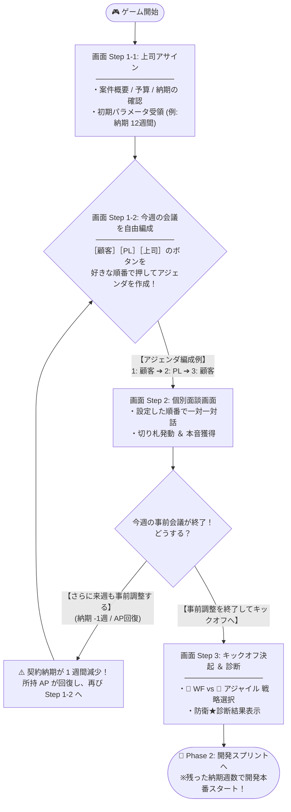
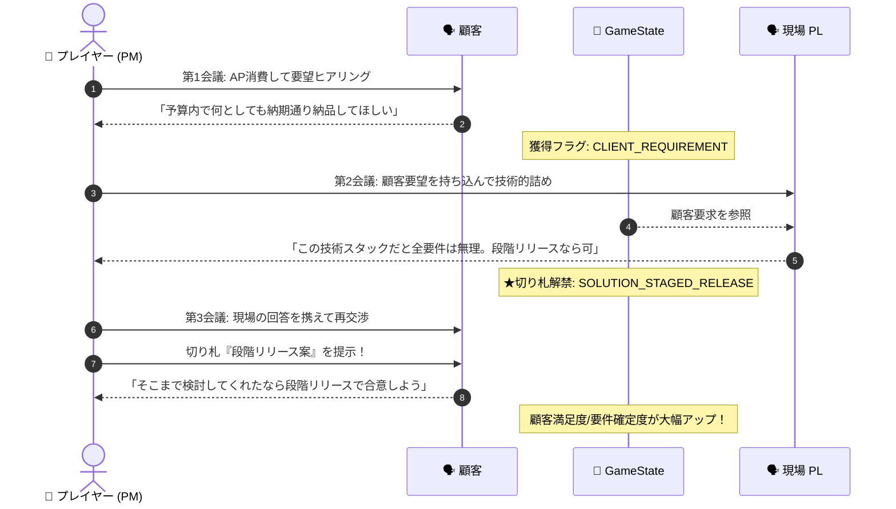
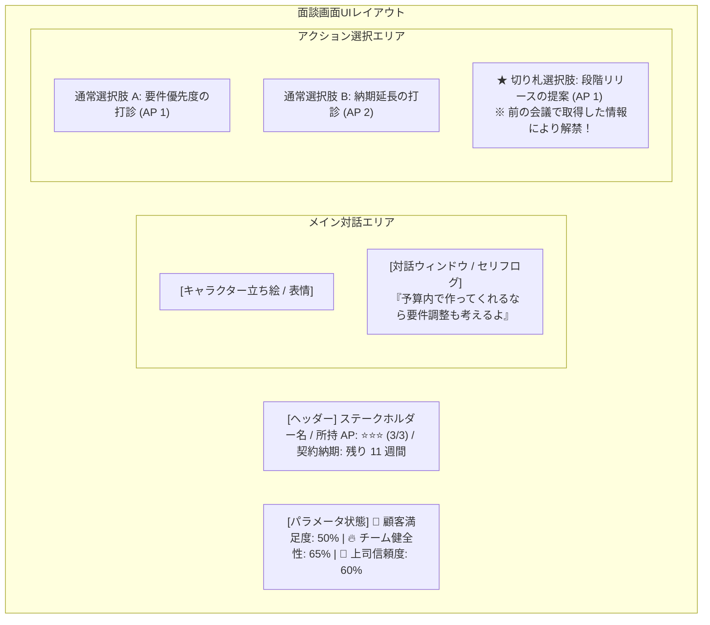

# 🚀 フェーズ1: キックオフ仕様 (Phase 1: Kickoff)

## 1. フェーズ概要
顧客・上司・現場の利害対立や案件の危険度（要件曖昧さ・無茶振り）を読み取り、初期のアサイン情報をもとにキックオフまでの「事前会議のセッティング（アジェンダの自由編成）」を決定。限られた時間（AP）と納期（週数）の中で関係者との個別面談・キャッチボール（往復調整）を行い、獲得した情報や切り札を活用して防衛ラインとデリバリー戦略を構築するフェーズ。

---

## 2. 🧭 画面遷移 ＆ 週単位タイムマネジメントフロー (Screen & Time Flow)

プレイヤーが自由に組み合わせる「事前会議アジェンダキュー」と、ターン経過（1週間消費）に伴う納期トレードオフの全体フローです。



---

## 3. ⏱️ タイムマネジメント ＆ 納期トレードオフ (Time vs Tradeoff)

事前会議を重ねることのメリットと、開発本番の納期を消費するデメリットのリアルなトレードオフルールです。

### ルール仕様
1. **1ターンの定義**: 事前会議キュー（最大3回分の面談）を1サイクル実行すると、**ゲーム内で 1 週間が経過**します。
2. **納期の減少**: 事前会議サイクルが終了し、来週も継続調整を選ぶたびに **「契約納期が 1 週間減少 (`deadlineWeeks - 1`)」** します。
3. **成果の保持**: 過去の面談で手に入れた「本音情報・切り札フラグ (`obtainedKnowledge`)」は次週以降も維持されます。
4. **任意の締めくくり**: 画面上の **「事前調整を終了してキックオフへ進む」** ボタンを押せば、いつでも即座に Step 3 へ移行できます。

> 💡 **プレイヤーの思考ジレンマ**:
> 事前調整に 2週・3週と時間をかければ、全切り札が揃い「要件確定度・チーム安全度★」が最大化するが、Phase 2（スプリント）に持ち込める残り開発期間が減って開発本番の炎上リスクが高まる。

---

## 4. 🔄 Step 2 情報引き継ぎ ＆ キャッチボールシーケンス (Data Flow)



---

## 5. ⏳ AP（時間）投資の頭打ち・限界効用メカニクス (Diminishing Returns)

同一面談相手や同一テーマへの過度な時間浪費を防止するルールです。

| 同一相手/テーマへのAP投入回数 | パラメータ評価 / 効果 | ゲーム上のシステム挙動 |
| :--- | :--- | :--- |
| **1回目の会議・投資 (AP 1)** | **【大 🟩】 +20〜30% 上昇** | 大筋の合意・本音リスク・重要フラグを最速獲得。 |
| **2回目の会議・投資 (AP 2)** | **【中 🟨】 +10% 上昇** | 細部のすり合わせ・切り札を使用した納得感向上。 |
| **3回目以降の投資 (AP 3〜)** | **【ゼロ / 時間の浪費 🟥】 +0%** | **⚠️ 「議論は平行線。時間（AP）だけが無駄に浪費された」** と表示され、パラメータは一切伸びない。 |

---

## 6. 🖼 対話画面レイアウト構成イメージ (UI Mockup Structure)



---

## 7. 5ステップ構成詳細仕様

1. **Step 1-1: 上司からの業務アサイン（状況把握）**
   - 上司から案件概要、予算・納期、顧客タイプ、現場（PL）のコンディションを把握。
   - 初期パラメータ（要件の曖昧さ/要求具体度、顧客の期待値、現場の負荷）がロード・設定される。
   - *※ 要求具体度（★1〜★5）: 顧客と現場の要件把握度を表す。事前会議などで上昇するが、開発初期段階（キックオフ時点）ではどれだけネゴしても★5には達しないことが多く、開発スプリント（Phase 2）の進行に伴って深まっていく。*

2. **Step 1-2: キックオフに向けた事前会議の自由セッティング（キュー構築）**
   - ［顧客］［PL］［上司］のボタンを順番に押し、今週開催する会議アジェンダキュー（例: `1: 顧客 ➔ 2: PL ➔ 3: 顧客`）を自由構築。

3. **Step 2-1 〜 Step 2-3: 個別事前会議の開催**
   - 設定した各会議（画面）において、一対一の対話に集中。
   - APを使い調整・ヒアリングを実施。前の会議で得た本音情報を「切り札」として活用。
   - 今週の会議終了時、**「さらに来週も事前調整する (納期 -1週)」** または **「事前調整を終了してキックオフへ進む」** を選択。

4. **Step 3: チームキックオフ決起 ＆ 防衛★診断**
   - デリバリー戦略（🌊 ウォーターフォール vs 🔄 アジャイル）を選択。
   - 事前会議の成果を受け、チーム・顧客・上司からの決起イベントが発生。
   - **3大防衛指標**（要件確定度/適応度、期待値ギャップ、チーム安全度）が★診断され、残った納期週数で Phase 2（開発スプリント）へ引き継がれる。

---

## 8. システム状態構造 (GameState Schema)

```javascript
GameState = {
  // 1. 案件初期データ (Step 1-1 ロード)
  projectInfo: {
    clientType: "CHANGE_PRONE",
    bossExpectation: "HIGH",
    teamCapability: "MEDIUM",
    deadlineWeeks: 12           // 契約納期週数 (事前会議経過により減小)
  },

  // 2. キックオフ進行状態
  kickoffState: {
    interviewSequence: [        // 自由編成された会議アジェンダキュー
      { target: "CLIENT", title: "対 顧客との要求すり合わせ会議" },
      { target: "PL", title: "対 PLとの技術・負荷打ち合わせ会議" },
      { target: "CLIENT", title: "対 顧客との現場対案持参・再交渉会議" }
    ],
    currentStepIndex: 0,        // 進行ステップインデックス
    obtainedKnowledge: ["CLIENT_REQUIREMENT", "SOLUTION_STAGED_RELEASE"], // 切り札フラグ
    interviewApInvested: {     // 各相手へのAP投入回数 (3回以上で頭打ち)
      CLIENT: 2,
      PL: 1,
      BOSS: 0
    },
    kickoffAp: 3,               // 今週の所持AP
    kickoffWeeksSpent: 0        // 事前調整に費やした週数
  },

  // 3. プロジェクト共通3大評価指標 (リアルタイム更新)
  metrics: {
    clientSatisfaction: 50,     // 👥 顧客満足度 (0〜100%)
    bossTrust: 50,              // 🏢 社内評価/上司信頼度 (0〜100%)
    teamHealth: 50              // 🔥 チーム健全性 (0〜100%)
  },

  // 4. 防衛・引き継ぎステータス (Step 3 確定)
  defenseStatus: {
    scopeCertainty: 0,          // 要件確定度 / スコープ防衛度
    expectationGap: 0,          // 期待値ギャップの適正化レベル
    deliveryStrategy: "AGILE"   // 🌊 WATERFALL vs 🔄 AGILE
  }
}
```
