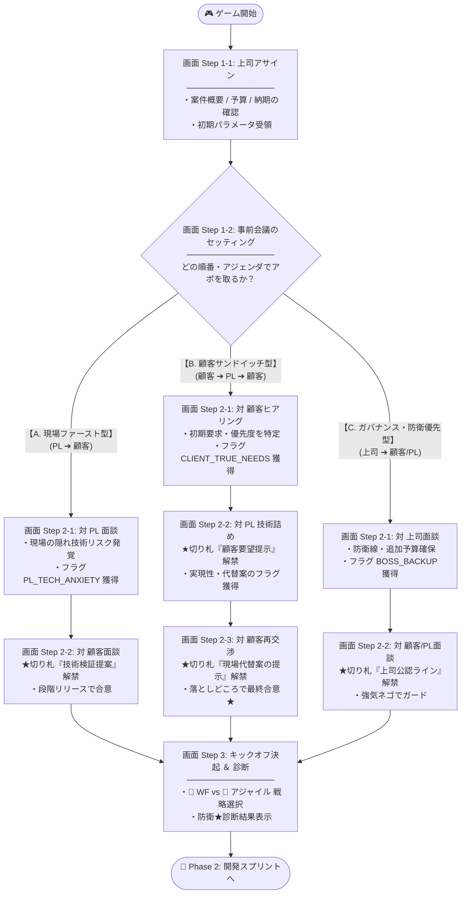
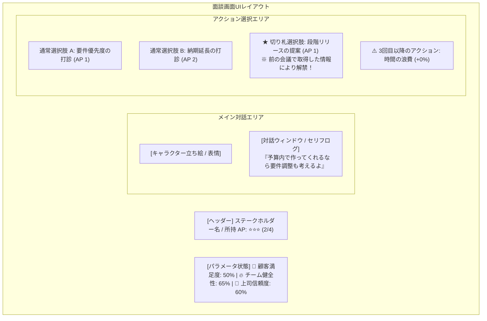

# 🚀 フェーズ1: キックオフ仕様 (Phase 1: Kickoff)

## 1. フェーズ概要
顧客・上司・現場の利害対立や案件の危険度（要件曖昧さ・無茶振り）を読み取り、初期のアサイン情報をもとにキックオフまでの「事前会議のセッティング（対話順序・アジェンダ）」を決定。限られた時間（AP）の中で関係者との個別面談・キャッチボール（往復調整）を行い、獲得した情報や切り札を活用して防衛ラインとデリバリー戦略を構築するフェーズ。

---

## 2. 🧭 画面遷移 ＆ ルート分岐フロー (Screen Flow)

プレイヤーがセッティングする「事前会議アジェンダ」に応じて、対話順序・面談画面の分岐・特別な切り札選択肢の解禁が決定されます。



---

## 3. 🔄 Step 2 情報引き継ぎ ＆ キャッチボールシーケンス (Data Flow)

面談 1 (Step 2-1) で手に入れた「相手の本音・隠れリスク」が `GameState` を介して面談 2 や再面談 3 で「切り札選択肢」として解禁され、合意を形成していく流れです。


---

## 4. ⏳ AP（時間）投資の頭打ち・限界効用メカニクス (Diminishing Returns)

有限な資源である AP（Action Point = 時間・工数）を同じ対話相手や同じテーマの会議に投入しすぎると、**「投資対効果が頭打ちとなり、時間だけが無駄に消費される」** 現実のタイムマネジメント・会議の罠を表現します。

### AP投入回数と効果の減衰ルール

| 同一相手/テーマへのAP投入回数 | パラメータ評価 / 効果 | ゲーム上のシステム挙動 |
| :--- | :--- | :--- |
| **1回目の会議・投資 (AP 1)** | **【大 🟩】 +20〜30% 上昇** | 大筋の合意・本音リスク・重要フラグを最速獲得。 |
| **2回目の会議・投資 (AP 2)** | **【中 🟨】 +10% 上昇** | 細部のすり合わせ・切り札を使用した納得感向上。 |
| **3回目以降の投資 (AP 3〜)** | **【ゼロ / 時間の浪費 🟥】 +0%** | **⚠️ 「議論は平行線。時間（AP）だけが無駄に浪費された」** と表示され、パラメータは一切伸びない。 |

> 💡 **プレイヤーへの指導原理**:
> 1人の関係者に時間を使いすぎず、適切なタイミングで「PLへ技術検証を回す」「上司へバックアップを仰ぐ」など、関係者へボールを回すタイムマネジメントがハイスコアの鍵となります。

---

## 5. 🖼 対話画面レイアウト構成イメージ (UI Mockup Structure)

Step 2-1, 2-2, 2-3 の個別面談画面のコンポーネント構成です。



---

## 6. 5ステップ構成詳細仕様

1. **Step 1-1: 上司からの業務アサイン（状況把握）**
   - 上司から案件概要、予算・納期、顧客タイプ、現場（PL）のコンディションを把握。
   - 初期パラメータ（要件の曖昧さ、顧客の期待値、現場の負荷）がロード・設定される。

2. **Step 1-2: キックオフに向けた事前会議のセッティング（アジェンダ選択）**
   - キックオフに向け、誰とどのような順番で事前会議（アポ/打ち合わせ）を行うかをセッティング。
   - **対話順序（`interviewSequence`）**および初期パラメータ補正が適用される。
     - **現場ファースト型**: `PL面談` ➔ `顧客面談`
     - **顧客サンドイッチ型**: `顧客ヒアリング` ➔ `PL技術詰め` ➔ `顧客再交渉` （キャッチボール調整）
     - **ガバナンス・防衛優先型**: `上司面談` ➔ `顧客/PL面談`

3. **Step 2-1 〜 Step 2-3: 個別事前会議の開催**
   - 設定した各会議（画面）において、一対一の対話に集中。
   - APを使い調整・ヒアリングを実施。前の会議で得た本音情報を「切り札」として活用。
   - **時間投資の頭打ちルール**: 同じ相手への過度なAP投入（3回目〜）は効果ゼロ（時間を無駄に浪費）。

4. **Step 3: チームキックオフ決起 ＆ 防衛★診断**
   - デリバリー戦略（🌊 ウォーターフォール vs 🔄 アジャイル）を選択。
   - 事前会議の成果を受け、チーム・顧客・上司からの決起イベントが発生。
   - **3大防衛指標**（要件確定度/適応度、期待値ギャップ、チーム安全度）が★診断され、Phase 2（開発スプリント）へ引き継がれる。

---

## 7. システム状態構造 (GameState Schema)

```javascript
GameState = {
  // 1. 案件初期データ (Step 1-1 ロード)
  projectInfo: {
    clientType: "CHANGE_PRONE", // 顧客タイプ (CHANGE_PRONE | COST_STRICT | QUALITY_FIRST)
    bossExpectation: "HIGH",    // 上司の要求度
    teamCapability: "MEDIUM"   // チーム能力
  },

  // 2. キックオフ進行状態 (Step 1-2 〜 Step 2)
  kickoffState: {
    selectedStrategy: "CLIENT_SANDWICH", // 選択アジェンダ ("PL_FIRST" | "CLIENT_SANDWICH" | "GOVERNANCE_FIRST")
    interviewSequence: ["CLIENT", "PL", "CLIENT"], // 事前会議の対話順序
    currentStepIndex: 0,        // 進行ステップインデックス
    obtainedKnowledge: ["CLIENT_REQUIREMENT", "SOLUTION_STAGED_RELEASE"], // 会議で獲得した切り札フラグ
    interviewApInvested: {     // 各相手へのAP投入回数 (3回以上で頭打ち)
      CLIENT: 2,
      PL: 1,
      BOSS: 0
    },
    actionPoints: 4            // 事前調整用AP
  },

  // 3. プロジェクト共通3大評価指標 (リアルタイム更新)
  metrics: {
    clientSatisfaction: 50,     // 👥 顧客満足度 (0〜100%)
    bossTrust: 50,              // 🏢 社内評価/上司信頼度 (0〜100%)
    teamHealth: 50              // 🔥 チーム健全性 (0〜100%)
  },

  // 4. 防衛・引き継ぎステータス (Step 3 確定)
  defenseStatus: {
    scopeCertainty: 0,          // 要件確定度 / スコープ防衛度
    expectationGap: 0,          // 期待値ギャップの適正化レベル
    deliveryStrategy: "AGILE"   // 🌊 WATERFALL vs 🔄 AGILE
  }
}
```
