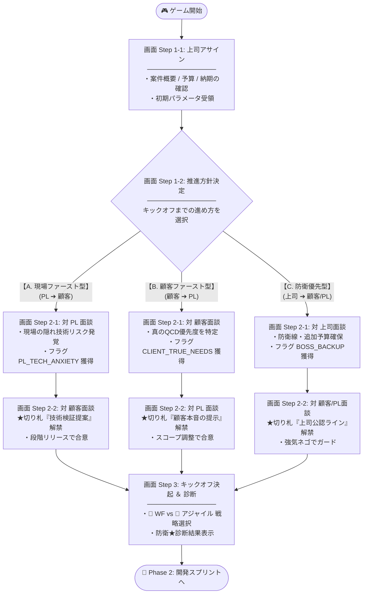
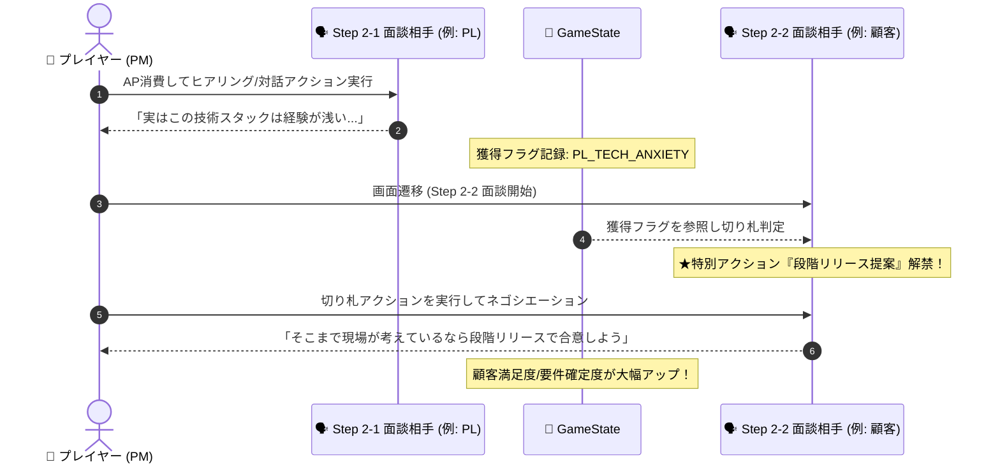
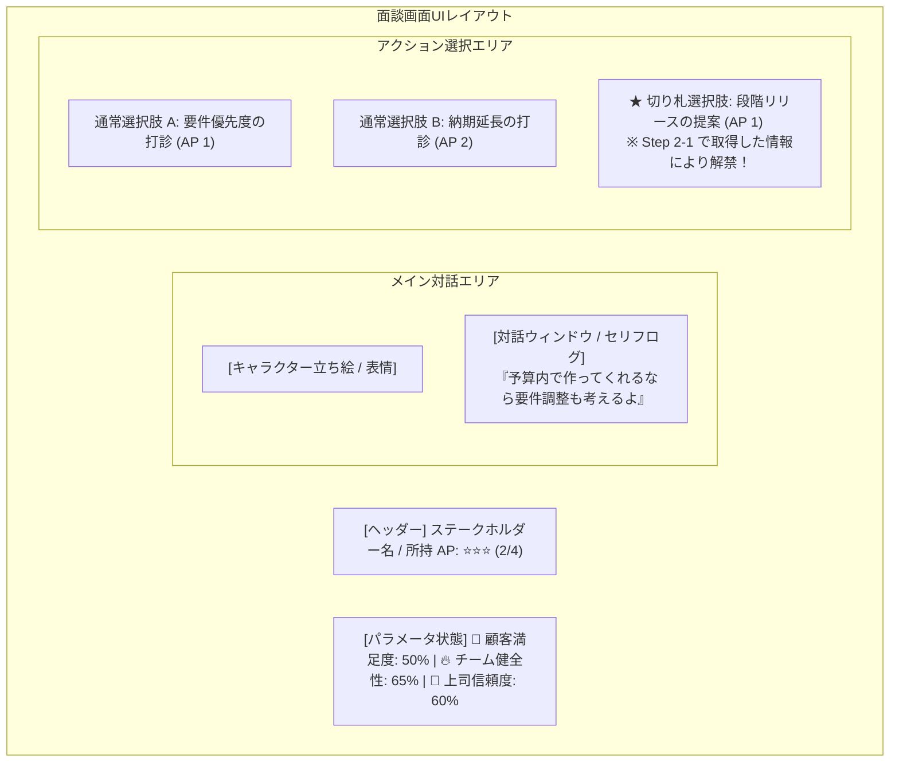

# 🚀 フェーズ1: キックオフ仕様 (Phase 1: Kickoff)

## 1. フェーズ概要
顧客・上司・現場の利害対立や案件の危険度（要件曖昧さ・無茶振り）を読み取り、初期のアサイン情報をもとにキックオフまでの「推進方針（アプローチ順序）」を決定。順序に沿った一対一の個別面談で獲得した情報や切り札を活用し、防衛ラインとデリバリー戦略を構築してチームで一致団結するフェーズ。

---

## 2. 🧭 画面遷移 ＆ ルート分岐フロー (Screen Flow)

プレイヤーが選択する方針に応じて、対話順序・面談画面の分岐・特別な切り札選択肢の解禁が決定されます。



---

## 3. 🔄 Step 2 情報引き継ぎ ＆ 切り札解禁シーケンス (Data Flow)

面談 1 (Step 2-1) で手に入れた「相手の本音・隠れリスク」が `GameState` を介して面談 2 (Step 2-2) の切り札選択肢として解禁される相互作用の流れです。



---

## 4. 🖼 対話画面レイアウト構成イメージ (UI Mockup Structure)

Step 2-1 および Step 2-2 の個別面談画面のコンポーネント構成です。目の前の相手とのやり取りに集中できるようシンプルに設計されます。



---

## 5. 5ステップ構成詳細仕様

1. **Step 1-1: 上司からの業務アサイン（状況把握）**
   - 上司から案件概要、予算・納期、顧客タイプ、現場（PL）のコンディションを把握。
   - 初期パラメータ（要件の曖昧さ、顧客の期待値、現場の負荷）がロード・設定される。

2. **Step 1-2: 推進方針決定（推進アプローチの選択）**
   - キックオフに向けた推進アプローチ（誰とどの順番で会話・調整するか）を選択。
   - 選択方針に応じて**対話順序（`interviewSequence`）**および初期パラメータ補正が適用される。
     - **現場ファースト型**: `Step 2-1 (PL)` ➔ `Step 2-2 (顧客)` （現場安全度UP / 隠れ技術リスク早期発覚）
     - **顧客ファースト型**: `Step 2-1 (顧客)` ➔ `Step 2-2 (PL)` （顧客信頼度UP / 真の優先度早期発覚）
     - **ガバナンス・防衛型**: `Step 2-1 (上司)` ➔ `Step 2-2 (顧客/PL)` （上司信頼度UP / 防御ライン・リソース確保）

3. **Step 2-1: 第1対話相手との個別面談**
   - 画面上には第1面談相手（立ち絵・表情・セリフ）と専用アクション選択肢のみを表示し、一対一の対話に集中。
   - AP（Action Point）を消費して調整・ヒアリングを実施。面談結果として**本音情報・潜在リスク（獲得フラグ `obtainedKnowledge`）**を取得。

4. **Step 2-2: 第2対話相手との個別面談**
   - 画面上には第2面談相手を表示。
   - Step 2-1 で獲得した情報・フラグを「切り札」として活用可能な**特別交渉アクション**が解禁。
   - 残り AP を使い、最終的な条件調整と防衛ラインの合意を図る。

5. **Step 3: チームキックオフ決起 ＆ 防衛★診断**
   - デリバリー戦略（🌊 ウォーターフォール vs 🔄 アジャイル）を選択。
   - 事前方針と両面談の成果を受け、チーム・顧客・上司からの決起イベントが発生。
   - **3大防衛指標**（要件確定度/適応度、期待値ギャップ、チーム安全度）が★診断され、Phase 2（開発スプリント）へ引き継がれる。

---

## 6. システム状態構造 (GameState Schema)

```javascript
GameState = {
  // 1. 案件初期データ (Step 1-1 ロード)
  projectInfo: {
    clientType: "CHANGE_PRONE", // 顧客タイプ (CHANGE_PRONE | COST_STRICT | QUALITY_FIRST)
    bossExpectation: "HIGH",    // 上司の要求度
    teamCapability: "MEDIUM"   // チーム能力
  },

  // 2. キックオフ進行状態 (Step 1-2 〜 Step 2)
  kickoffState: {
    selectedStrategy: "PL_FIRST", // 選択方針 ("PL_FIRST" | "CLIENT_FIRST" | "GOVERNANCE_FIRST")
    interviewSequence: ["PL", "CLIENT"], // 面談の対話順序
    currentStepIndex: 0,        // 進行ステップインデックス
    obtainedKnowledge: ["PL_TECH_ANXIETY"], // Step 2-1 で獲得した切り札フラグ
    actionPoints: 4            // 事前調整用AP
  },

  // 3. プロジェクト共通3大評価指標 (リアルタイム更新)
  metrics: {
    clientSatisfaction: 50,     // 👥 顧客満足度 (0〜100%)
    bossTrust: 50,              // 🏢 社内評価/上司信頼度 (0〜100%)
    teamHealth: 50              // 🔥 チーム健全性 (0〜100%)
  },

  // 4. 防衛・引き継ぎステータス (Step 3 確定)
  defenseStatus: {
    scopeCertainty: 0,          // 要件確定度 / スコープ防衛度
    expectationGap: 0,          // 期待値ギャップの適正化レベル
    deliveryStrategy: "AGILE"   // 🌊 WATERFALL vs 🔄 AGILE
  }
}
```
