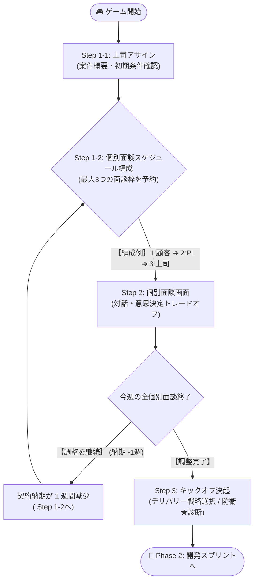
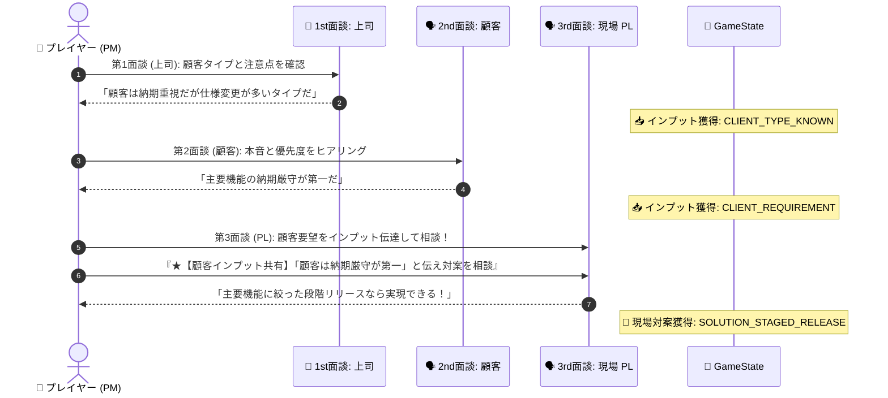
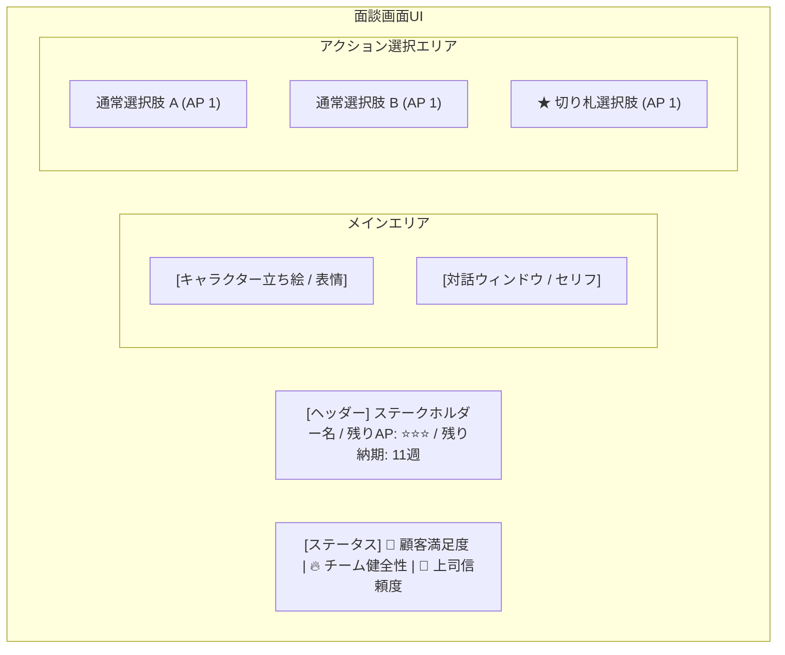

# 🚀 フェーズ1: キックオフ仕様 (Phase 1: Kickoff)

## 1. フェーズ概要
顧客・上司・現場の利害対立や案件の危険度（要件曖昧さ・無茶振り）を読み取り、初期のアサイン情報をもとにキックオフまでの「今週の個別面談スケジュール（個別会議の自由編成）」を決定。限られた納期（週数）の中で関係者との個別面談・キャッチボール（ハシゴ調整 ＆ 情報インプット伝達）を行い、獲得した本音情報や共有カードを活用して防衛ラインとデリバリー戦略を構築するフェーズ。

---

## 2. 🧭 画面遷移 ＆ 週単位タイムマネジメントフロー (Screen & Time Flow)

プレイヤーが自由に組み合わせる「個別面談スケジュール（最大3枠）」と、ターン経過（1週間消費）に伴う納期トレードオフの全体フローです。



---

## 3. ⏱️ タイムマネジメント ＆ 意思決定トレードオフ (Time vs Decision Tradeoff)

面談での情報ヒアリングはポイント制限なく自由に実行できますが、「どのような約束・態度で回答するか」の意思決定によって、ステークホルダー間（顧客 vs 現場 vs 上司）の利害対立・トレードオフが発生します。

### ルール仕様
1. **1ターンの定義**: 面談スケジュール（最大3つの個別会議）を1サイクル実行すると、**ゲーム内で 1 週間が経過**します。
2. **納期の減少**: 今週の全面談が終了し、来週も継続調整を選ぶたびに **「契約納期が 1 週間減少 (`deadlineWeeks - 1`)」** します。
3. **成果の保持**: 過去の面談で手に入れた「本音情報・持ち込みインプットカード (`obtainedKnowledge`)」は次週以降も維持され、別の会議で伝達可能になります。
4. **ヒアリング無制限化**: 確認・情報収集アクションは制限なく実行可能。プレイヤーは必要十分な情報を揃えて判断を下せます。
5. **意思決定トレードオフ**: 「顧客を立てれば現場が炎上し、現場を立てれば顧客が激怒する」八方美人リスクがリアルタイムに発生します。

> 💡 **プレイヤーの思考ジレンマ**:
> 相手の言いなりになれば別のステークホルダーが犠牲になる。事前に他の会議で手に入れた情報・対案カード（インプット共有）を使って交渉することで、初めて双方が納得する着地点（Win-Win）を導き出せる。

---

## 4. 🔄 Step 2 会議間情報引き継ぎ ＆ インプット伝達シーケンス (Data Flow)

前の会議で得たインプット情報（顧客の本音、上司の助言、PLのリスク）を、次の個別会議の相手にそのまま「インプット共有・交渉カード」として提示・伝達できます。



---

## 4.1 🏢 各個別面談における情報インプット伝達カード仕様

| 面談相手 | アクション名 / インプット共有カード | 解放条件 | 得られる効果・フラグ |
| :--- | :--- | :--- | :--- |
| **現場PL** | **★【顧客インプット共有】「顧客は納期厳守を最優先している」と伝え対案相談** | 顧客面談で `CLIENT_REQUIREMENT` 獲得済み | チーム健全性 +25%、`SOLUTION_STAGED_RELEASE` |
| **現場PL** | **★【上司インプット共有】「顧客は仕様変更多めタイプ」と伝え防衛ライン協議** | 上司面談で `CLIENT_TYPE_KNOWN` 獲得済み | チーム健全性 +20% |
| **上司** | **★【現場インプット共有】「現場の技術経験不足・負荷リスク」を提示し予備リソース申請** | PL面談で `PL_TECH_ANXIETY` 獲得済み | 上司信頼度 +30%、チーム健全性 +20%、`BOSS_RESOURCE_GRANTED` |
| **顧客** | **★【現場対案インプット】「現場と策定した段階リリース案」を提示し最終合意** | PL面談で `SOLUTION_STAGED_RELEASE` 獲得済み | 顧客満足度 +30%、要求具体度 +1 |
| **顧客** | **★【上司方針インプット】「上司と取りつけた会社公認品質ライン」を提示** | 上司面談で `BOSS_BACKUP` 獲得済み | 顧客満足度 +25% |

---

## 5. ⏳ AP（時間）投資の頭打ち・限界効用メカニクス (Diminishing Returns)

同一面談相手や同一テーマへの過度な時間浪費を防止するルールです。

| 同一相手/テーマへのAP投入回数 | パラメータ評価 / 効果 | ゲーム上のシステム挙動 |
| :--- | :--- | :--- |
| **1回目の会議・投資 (AP 1)** | **【大 🟩】 +20〜30% 上昇** | 大筋の合意・本音リスク・重要フラグを最速獲得。 |
| **2回目の会議・投資 (AP 2)** | **【中 🟨】 +10% 上昇** | 細部のすり合わせ・切り札を使用した納得感向上。 |
| **3回目以降の投資 (AP 3〜)** | **【ゼロ / 時間の浪費 🟥】 +0%** | **⚠️ 「議論は平行線。時間（AP）だけが無駄に浪費された」** と表示され、パラメータは一切伸びない。 |

---

## 6. 🖼 対話画面レイアウト構成イメージ (UI Mockup Structure)



---

## 7. 5ステップ構成詳細仕様

1. **Step 1-1: 上司からの業務アサイン（状況把握）**
   - 上司から案件概要、予算・納期、顧客タイプ、現場（PL）のコンディションを把握。
   - 初期パラメータ（要件の曖昧さ/要求具体度、顧客の期待値、現場の負荷）がロード・設定される。
   - *※ 要求具体度（★1〜★5）: 顧客と現場の要件把握度を表す。事前会議などで上昇するが、開発初期段階（キックオフ時点）ではどれだけネゴしても★5には達しないことが多く、開発スプリント（Phase 2）の進行に伴って深まっていく。*

2. **Step 1-2: キックオフに向けた事前会議の自由セッティング（キュー構築）**
   - ［顧客］［PL］［上司］のボタンを順番に押し、今週開催する会議アジェンダキュー（例: `1: 顧客 ➔ 2: PL ➔ 3: 顧客`）を自由構築。

3. **Step 2-1 〜 Step 2-3: 個別事前会議の開催**
   - 設定した各会議（画面）において、一対一の対話に集中。
   - APを使い調整・ヒアリングを実施。前の会議で得た本音情報を「切り札」として活用。
   - 今週の会議終了時、**「さらに来週も事前調整する (納期 -1週)」** または **「事前調整を終了してキックオフへ進む」** を選択。

4. **Step 3: チームキックオフ決起 ＆ 防衛★診断**
   - デリバリー戦略（🌊 ウォーターフォール vs 🔄 アジャイル）を選択。
   - 事前会議の成果を受け、チーム・顧客・上司からの決起イベントが発生。
   - **3大防衛指標**（要件確定度/適応度、期待値ギャップ、チーム安全度）が★診断され、残った納期週数で Phase 2（開発スプリント）へ引き継がれる。

---

## 8. システム状態構造 (GameState Schema)

```javascript
GameState = {
  // 1. 案件初期データ (Step 1-1 ロード)
  projectInfo: {
    clientType: "CHANGE_PRONE",
    bossExpectation: "HIGH",
    teamCapability: "MEDIUM",
    deadlineWeeks: 12           // 契約納期週数 (事前会議経過により減小)
  },

  // 2. キックオフ進行状態
  kickoffState: {
    interviewSequence: [        // 自由編成された会議アジェンダキュー
      { target: "CLIENT", title: "対 顧客との要求すり合わせ会議" },
      { target: "PL", title: "対 PLとの技術・負荷打ち合わせ会議" },
      { target: "CLIENT", title: "対 顧客との現場対案持参・再交渉会議" }
    ],
    currentStepIndex: 0,        // 進行ステップインデックス
    obtainedKnowledge: ["CLIENT_REQUIREMENT", "SOLUTION_STAGED_RELEASE"], // 切り札フラグ
    interviewApInvested: {     // 各相手へのAP投入回数 (3回以上で頭打ち)
      CLIENT: 2,
      PL: 1,
      BOSS: 0
    },
    kickoffAp: 3,               // 今週の所持AP
    kickoffWeeksSpent: 0        // 事前調整に費やした週数
  },

  // 3. プロジェクト共通3大評価指標 (リアルタイム更新)
  metrics: {
    clientSatisfaction: 50,     // 👥 顧客満足度 (0〜100%)
    bossTrust: 50,              // 🏢 社内評価/上司信頼度 (0〜100%)
    teamHealth: 50              // 🔥 チーム健全性 (0〜100%)
  },

  // 4. 防衛・引き継ぎステータス (Step 3 確定)
  defenseStatus: {
    scopeCertainty: 0,          // 要件確定度 / スコープ防衛度
    expectationGap: 0,          // 期待値ギャップの適正化レベル
    deliveryStrategy: "AGILE"   // 🌊 WATERFALL vs 🔄 AGILE
  }
}
```
