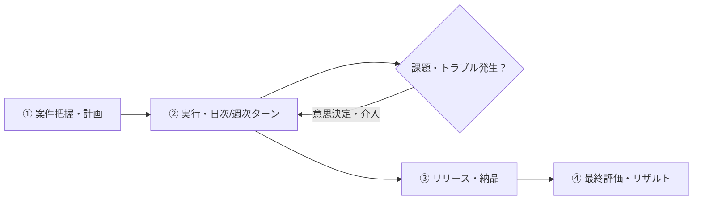

# PM Simulator v2 - ゲームデザイン・全体概要

## 🎯 ゲームコンセプト
プレイヤーがプロジェクトマネージャー（PM）となり、単一のソフトウェア開発プロジェクトを任され、ステークホルダー（顧客・経営層）や開発チームと向き合いながら、限られたリソースと時間の中でプロジェクトを成功（納期・品質・コスト・満足度）へと導く**プロジェクト完結型シミュレーションゲーム**。

---

## 📌 コア体験・目指す面白さ
1. **「正解が一つではない」リアルな意思決定とジレンマ**
   - QCD（品質・コスト・納期）とチームの健全性・顧客の信頼関係のトレードオフ
   - 「残業で納期を死守するか、品質低下・炎上リスクを許容するか、スコープを削る交渉をするか」
2. **直感的な操作性と深い状況把握**
   - 複雑すぎないコマンド選択体系でありながら、状況の読み違いがトラブルを招く戦略性
   - チームや顧客の「隠れた不満」や「潜在リスク」を観察・察知して先手を打つ面白さ

---

## 🔄 コアループ（単一プロジェクト完結型）

1. **【開始】案件把握・計画策定**
   - プロジェクト要件（納期、予算、目標品質、スコープ）の確認
   - チームメンバー（能力、性格、得手不得手）とステークホルダー（顧客の要望レベル、厳しさ）の把握
2. **【進行】実行フェーズ（ターン制の意思決定サイクル）**
   - 日次または週次単位で状況を確認（進捗・メンバー疲労度・バグ発生・顧客信頼）
   - 限られた行動リソース（AP・時間）を使って、方針指示・面談・交渉・リスク対策などのコマンドを実行
   - 突発イベント（仕様変更、要員離脱、バグ多発など）への対応判断
3. **【終了】リリース・納品**
   - 最終的な成果物を顧客へ納品・検収
4. **【評価】総合リザルト精算**
   - 納期遵守率、最終品質、予算消化率、顧客満足度、チーム健全度の各指標に基づいた総合スコア判定

---

## 📝 検討論点・次のステップ
1. **進行単位（ターン設計）**: 日次ターン制（例：全30日〜60日） vs 週次スプリント制（例：全8〜12週）
2. **PMの介入手段（コマンド体系）**: 方針提示、1on1、顧客折衝、スコープ調整、品質強化など
3. **チーム・顧客のパラメータモデル**: モチベーション、疲労度、スキル、信頼度
4. **イベント・リスクシステム**: 予兆（インサイト）の検知とトラブルの連鎖
