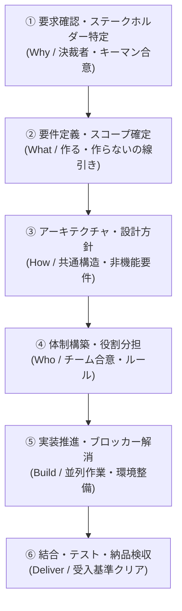
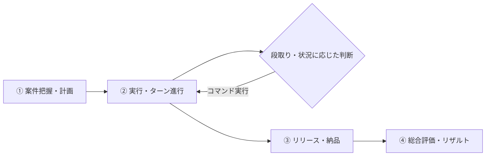

# PM Simulator v2 - ゲームデザイン・全体概要

## 🎯 開発の背景と目的（Why）
**「正しいプロジェクトマネジメント（PM）の役割と段取りを理解していない人に、王道の進め方の重要性と効果を実体験してもらうこと」**

ソフトウェア開発の現場では、「何を作るか決まる前に人を集めてしまう」「設計や方針を決めずに手を動かさせてしまう」「合意相手を間違えて後からちゃぶ台返しを食らう」といったアンチパターンによる炎上が後を絶ちません。
本ゲームは、プレイヤーがPMとなり、**「教科書通りの正しい順序とステークホルダーマネジメントを行うことでプロジェクトが驚くほどスムーズに成功する達成感」** と、**「段取りや合意形成を怠った結果として発生するリアルな手戻りの恐ろしさ」** を体験的に学ぶシミュレーションゲームです。

---

## 📌 コア体験・目指す面白さ

### 1. 「王道の段取り（ベストプラクティス）」による成功の再現性
* 焦らず正しい順序で前提条件（土台）を整えることで、後半の実装・テストが手戻りなく爆速かつ高品質に進む気持ちよさを実感できる。

### 2. 「ステークホルダーのキーマン見極めと合意形成」
* 現場担当者だけでなく、「最終決裁者（部長・役員）」や「技術/セキュリティ責任者（情シス）」を特定し、適切なタイミングで合意を取り付ける重要性を体験。
* 「現場とだけ握って安心していたら、納品間際に決裁者にひっくり返される」という定番トラップを予防・対処するリアルな学び。

### 3. 「アンチパターン（段取り飛ばし）」による納得の手戻りと学び
* 「早く実装させたいから設計を省く」「要求が曖昧なまま人を増やす」といった判断をすると、なぜそれが失敗するのか（手持ち無沙汰・コンフリクト・仕様違いの全作り直し）が因果関係として跳ね返る。

### 4. 将来の拡張性を備えたモジュール構造
* まずは「基本の教科書シナリオ」で王道プロセスの効果を体感できるようにする。
* 後から「突発リスクイベント」「個性豊かなメンバー」「案件別シナリオ」などを柔軟にプラグイン追加できるイベント駆動型のソフトウェア構造とする。

---

## 📐 PMの標準意思決定ステップ（王道プロセス）



| ステップ | 正しいPMの行動（ベストプラクティス） | 段取りを飛ばした時のアンチパターン ＆ 失敗結果 |
| :--- | :--- | :--- |
| **① 要求確認 ＆<br/>キーマン特定** | なぜ作るのか目的を明確化し、**現場担当者だけでなく最終決裁者（部長等）とも目的を合意**する | 現場担当者とだけ握って進め、納品直前に決裁者から「こんなの承認していない」とちゃぶ台返し |
| **② 要件定義 ＆<br/>スコープ確定** | スコープ（やる事/やらない事）と受入基準を決め、情シス等の非機能要件（セキュリティ等）も確認 | 要件未確定で人をアサインしてコスト浪費、あるいは情シス確認を怠り納品直前にセキュリティNG |
| **③ 設計・方針** | 共通アーキテクチャ・インターフェース・規約を決める | 設計なしで各自が実装を始め、結合時にデータ不整合とコンフリクトが爆発 |
| **④ 体制構築** | 各自のスキルと特性に応じた役割分担とチームルールを決める | 役割が不明確で責任のなすり合い、特定メンバーへのボトルネック発生 |
| **⑤ 実装推進** | メンバーが集中できる環境を作り、進捗とブロッカーを解消 | 無理な残業や割り込み指示でモチベーション低下・バグ混入・離職 |
| **⑥ テスト・納品**| 受入基準に沿って品質検証を行い、スムーズに検収を受ける | テスト基準がなくリリース直前に致命的障害多発 |

---

## 👥 ステークホルダーモデル（顧客・社内）

```text
【顧客側ステークホルダー例】
┌───────────────────┬────────────────────────────────────────────────────────┐
│ 役職 / 立場       │ 特徴とPMとしての関わり方                               │
├───────────────────┼────────────────────────────────────────────────────────┤
│ 👤 現場担当者     │ 業務仕様に詳しい。打ち合わせしやすいが、最終決定権はない。│
│ 👔 最終決裁者(部長)│ 忙しく捕まりにくいが、最終承認・ちゃぶ台返し権限限を持つ。 │
│ 🛡️ 情シス/セキュリティ│ セキュリティ・インフラ規約の拒否権を持つ。                │
└───────────────────┴────────────────────────────────────────────────────────┘
```

---

## 🔄 コアループ（単一プロジェクト完結型）



1. **【開始】案件把握・計画フェーズ**
   - 案件の基本情報（納期・予算・目標品質・顧客関係者・チーム構成）を把握
2. **【進行】実行フェーズ（ターン制の意思決定）**
   - 適切なPMアクション（ヒアリング・決裁者レビュー・スコープ定義・設計検討・体制指示・レビュー等）を選択
   - 「段取りの充足度」および「ステークホルダー合意度」に応じて、後続フェーズの作業効率と手戻り率がリアルタイムに変動
3. **【終了】リリース・納品**
   - 成果物の検収・決裁者による最終承認
4. **【評価】総合リザルト精算**
   - 納期・品質・コスト・顧客満足度・チーム健全度の各指標と、「正しいPM行動（段取り・合意形成）ができたか」のフィードバック表示

---

## 🛠 ソフトウェアアーキテクチャ方針（拡張性の担保）

1. **フェーズ＆前提条件マネージャー (Phase & Precondition Manager)**
   - 各ステップの前提充足度（要求確定度、決裁者合意度、設計完了度など）を数値モデル化し、後続処理への影響（手戻り係数、開発速度係数）を算出
2. **イベント駆動システム (Event-Driven System)**
   - 前提不足による「ちゃぶ台返しイベント」「バグ発生イベント」「仕様変更イベント」を疎結合なイベント定義として後から自由に追加可能
3. **シナリオ・データ分離**
   - 案件データ、ステークホルダーデータ、メンバーデータ、アクション効果をJSON等の外部定義で拡張可能にする
