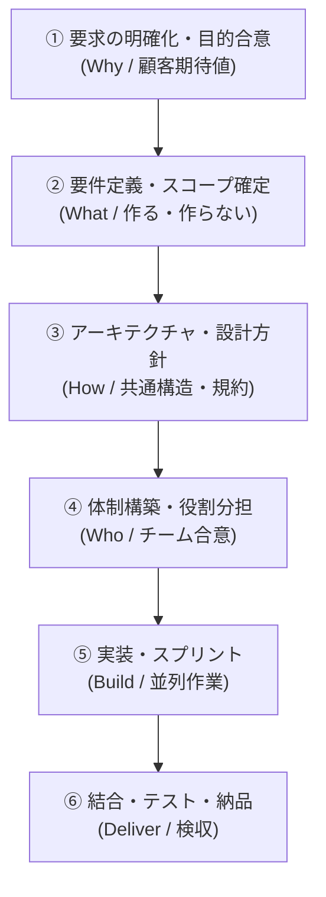
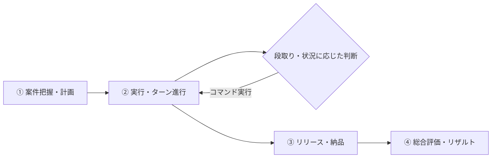

# PM Simulator v2 - ゲームデザイン・全体概要

## 🎯 開発の背景と目的（Why）
**「正しいプロジェクトマネジメント（PM）の役割と段取りを理解していない人に、王道の進め方の重要性と効果を実体験してもらうこと」**

ソフトウェア開発の現場では、「何を作るか決まる前に人を集めてしまう」「設計や方針を決めずに手を動かさせてしまう」といったアンチパターンによる炎上が後を絶ちません。
本ゲームは、プレイヤーがPMとなり、**「教科書通りの正しい順序で意思決定を行うことでプロジェクトが驚くほどスムーズに成功する達成感」** と、**「段取りを飛ばした結果として発生するリアルな手戻りの恐ろしさ」** を体験的に学ぶシミュレーションゲームです。

---

## 📌 コア体験・目指す面白さ

### 1. 「王道の段取り（ベストプラクティス）」による成功の再現性
* 焦らず正しい順序で前提条件（土台）を整えることで、後半の実装・テストが手戻りなく爆速かつ高品質に進む気持ちよさを実感できる。

### 2. 「アンチパターン（段取り飛ばし）」による納得の手戻りと学び
* 「早く実装させたいから設計を省く」「要求が曖昧なまま人を増やす」といった判断をすると、なぜそれが失敗するのか（手持ち無沙汰・コンフリクト・仕様違いの全作り直し）が因果関係として跳ね返る。

### 3. 将来の拡張性を備えたモジュール構造
* まずは「基本の教科書シナリオ」で王道プロセスの効果を体感できるようにする。
* 後から「突発リスクイベント」「個性豊かなメンバー」「顧客との厳しい交渉」「案件別シナリオ」などを柔軟にプラグイン追加できるイベント駆動型のソフトウェア構造とする。

---

## 📐 PMの標準意思決定ステップ（王道プロセス）

| ステップ | 正しいPMの行動（ベストプラクティス） | 段取りを飛ばした時のアンチパターン ＆ 失敗結果 |
| :--- | :--- | :--- |
| **① 要求確認** | なぜ作るのか、真の目的と優先度を顧客と合意する | 目的が曖昧なまま進み、納品時に「欲しかったのはこれじゃない」と全否定 |
| **② 要件定義** | スコープ（やる事/やらない事）と受入基準を明確にする | 要件未確定で人をアサインし、メンバーが何をすればいいか分からずコスト浪費 |
| **③ 設計・方針** | 共通アーキテクチャ・インターフェース・規約を決める | 設計なしで各自が実装を始め、結合時にデータ不整合とコンフリクトが爆発 |
| **④ 体制構築** | 各自のスキルと特性に応じた役割分担とルールを決める | 役割が不明確で責任のなすり合い、ボトルネックの発生 |
| **⑤ 実装推進** | メンバーが集中できる環境を作り、進捗とブロッカーを解消 | 無理な残業や割り込み指示でモチベーション低下・バグ混入 |
| **⑥ テスト・納品**| 受入基準に沿って品質検証を行い、スムーズに検収を受ける | テスト基準がなくリリース直前に致命的障害多発 |

---

## 🔄 コアループ（単一プロジェクト完結型）

1. **【開始】案件把握・計画フェーズ**
   - 案件の基本情報（納期・予算・目標品質・顧客・チーム構成）を把握
2. **【進行】実行フェーズ（ターン制の意思決定）**
   - フェーズや状況に応じて、適切なPMアクション（ヒアリング・スコープ定義・設計検討・体制指示・レビュー等）を選択
   - 「土台の充足度」に応じて、後続フェーズの作業効率と手戻り率がリアルタイムに変動
3. **【終了】リリース・納品**
   - 成果物の検収・顧客確認
4. **【評価】総合リザルト精算**
   - 納期遵守率・品質・予算・顧客満足度・チーム健全度の各指標と、「正しいPM行動ができたか」のフィードバック表示

---

## 🛠 ソフトウェアアーキテクチャ方針（拡張性の担保）

1. **フェーズ＆前提条件マネージャー (Phase & Precondition Manager)**
   - 各ステップの「前提充足度（要求確定度、設計完了度など）」を数値モデル化し、後続処理への影響（手戻り係数、開発速度係数）を算出
2. **イベント駆動システム (Event-Driven System)**
   - 前提不足による「バグ発生イベント」「仕様変更イベント」「メンバー不満イベント」を疎結合なイベント定義として後から自由に追加可能
3. **シナリオ・データ分離**
   - 案件データ、メンバーデータ、アクション効果をJSON等の外部定義で拡張可能にする
