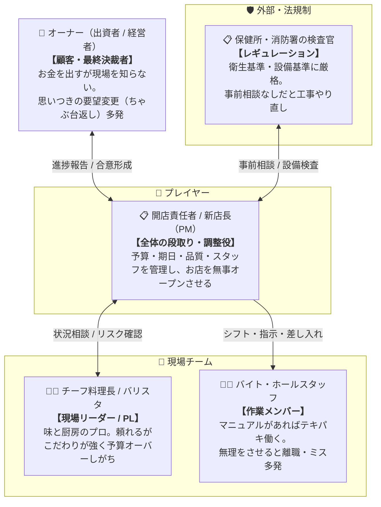
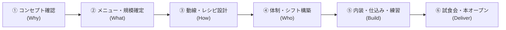
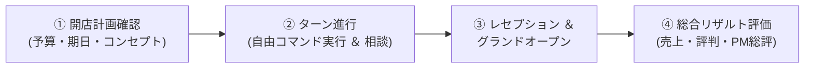

# PM Simulator v3 - カフェ新規オープン編 仕様概要

## 🎯 開発の背景と目的（Why）
**「専門知識がなくても直感的に遊べる『カフェの新規開店プロジェクト』を通じて、正しいプロジェクトマネジメント（PM）の段取り・合意形成・チームマネジメントの重要性を実体験すること」**

### 💡 なぜ「カフェ新規オープン」なのか？
これまでのIT開発テーマでは、「アーキテクチャ」「API」「テストコード」といった専門用語や技術的ディテールに思考が引っ張られ、プレイヤーにとっても開発者にとっても本来のマネジメントの本質（段取り・人間関係・トレードオフ）以外の難易度が高くなっていました。

カフェ（飲食店）の立ち上げは、誰もが直感的にイメージできる身近なテーマでありながら、**PMに必要なすべての要素（Why/What/How/Who/Build/Deliver）とリアルなジレンマが完璧に成立**します。

---

## 📌 コア体験・目指す面白さ

### 1. 「王道の段取り（レシピ・動線）」による成功の気持ちよさ
* 焦って食材を買い込んだり内装工事を急がず、コンセプト・レシピ・動線設計をしっかり整えることで、プレオープンや本番で驚くほどスムーズにお店が回る達成感を味わえる。

### 2. 「専門知識ゼロ」で直感的に状況がわかるシステム
* IT用語を完全に排除。「動線設計」「調理レシピ」「保健所の許可」といった誰もが知っている言葉で、プロジェクトの土台とリスクを可視化。

### 3. 「チーフ（現場リーダー）との相談」による人間的な状況把握
* 単なるパーセンテージ（数値）を見るだけでなく、厨房を仕切る頑固なチーフ料理長との対話を通じて「今何が足りていて、どこに無理があるか」の肌感覚を掴んで判断する。

### 4. 「オーナーのちゃぶ台返し」と「保健所の壁」への先手対策
* 口うるさいオーナーにこまめに進捗を共有して「合意（サイン）」を取り付けたり、工事前に保健所へ事前相談に行くなど、PM必須のステークホルダーマネジメントを体験。

### 5. 「自由な意思決定（フェーズ非固定）」による納得の失敗と学び
* システムがフェーズを強制せず、**最初からすべてのPMコマンドが実行可能**。
* 段取りを飛ばして「いきなり内装工事」や「大量の仕入れ」をして大赤字・やり直しになるという、リアルな失敗からの学びが得られる。

---

## 📖 専門用語を使わない「PM概念」対応表

| PM / ITの概念 | カフェオープンでの表現 | 意味・役割（なぜ大切か） |
| :--- | :--- | :--- |
| **アーキテクチャ / 基礎設計** | **厨房・客席の動線レイアウト** | 配膳動線やコンロ位置。これが悪いと料理が出せず後から大改装 |
| **API / データ仕様** | **調理レシピ ＆ マニュアル** | 誰が作っても同じ味・時間で出せる約束事。ないと味とオペが崩壊 |
| **スコープ定義** | **メニュー数 ＆ 客席規模** | やること・やらないことの線引き。多すぎると仕込みがパンクする |
| **非機能要件 / レギュレーション** | **保健所・消防の営業許可基準** | 衛生・防災ルール。無視するとオープン当日に営業停止を食らう |
| **単体・結合テスト** | **オペレーション練習（模擬営業）** | 注文から配膳までの連携確認。ぶっつけ本番だと注文伝票が散乱 |
| **受入テスト / 検収** | **レセプション（関係者試食会）** | オーナーや関係者を招いての最終チェック。合格でオープン決定 |

---

## 👥 登場人物モデル



---

## 📐 PMの標準意思決定ステップ（王道プロセス）



| ステップ | 正しいPMの行動（ベストプラクティス） | 段取りを飛ばした時の失敗結果（アンチパターン） |
| :--- | :--- | :--- |
| **① コンセプト確認 ＆<br/>オーナー合意** | ターゲット客層や予算を明確にし、**オーナーから書面で合意を取り付ける** | 現場だけで進め、完成直前にオーナーから「こんな地味なカフェにする気じゃなかった」と全取っ替え |
| **② メニュー確定 ＆<br/>許可基準確認** | 看板メニューを絞り込み、保健所・消防の設備基準を事前にヒアリング | メニューを増やしすぎて仕込み不能に。保健所ルール無視で手洗い場の追加工事が発生 |
| **③ 動線 ＆ レシピ設計** | 厨房のすれ違い動線と、誰でも作れるレシピマニュアルを完成させる | レシピなしで各自が勘で調理。動線が悪くて厨房内でスタッフが激突 |
| **④ 体制・シフト構築** | 必要人数を算出して採用し、役割分担とトレーニング計画を立てる | 人手不足のまま突入して既存スタッフが過労で退職。役割分担が曖昧で注文が放置される |
| **⑤ 工事・練習推進** | チーフと連携して内装工事を進め、スタッフに模擬注文の練習をさせる | 練習なしで本番を迎え、伝票が紛失・料理提供に40分かかって客が激怒 |
| **⑥ 試食会・本オープン** | 関係者を招いたレセプションで課題を洗い出し、万全の状態でグランドオープン | チェックなしでオープンし、レジが動かない・お皿が足りない大パニックで即日炎上 |

---

## 🖥 ゲーム画面イメージ（状況可視化 ＆ 自由コマンド制）

```text
┌────────────────────────────────────────────────────────────────────────┐
│ ☕ カフェ開店プロジェクト・ダッシュボード                              │
│                                                                        │
│ 🎯 開店準備の土台（準備状況）:                                         │
│  ・コンセプト合意     : [██████░░░░] 60% (オーナー確認中)              │
│  ・メニュー ＆ 規模   : [████░░░░░░] 40%                               │
│  ・動線レイアウト     : [██░░░░░░░░] 20%                               │
│  ・調理レシピ・マニュアル: [░░░░░░░░░░]  0% (未着手)                   │
│  ・内装工事 ＆ 機器設置 : [░░░░░░░░░░]  0%                             │
│  ・スタッフ研修・練習 : [░░░░░░░░░░]  0%                               │
│                                                                        │
│ 💬 チーフ料理長（PL）の助言:                                           │
│ 「動線レイアウトは固まりましたが、まだ『調理レシピ』ができてません。   │
│   今バイトに練習させても、味も手順もバラバラで時間の無駄になりますよ！」│
│                                                                        │
│ ⏳ 資源: 開店まで 残り 25日 / 予算残 380万円 / スタッフ士気 80 / AP: 3/3 │
├────────────────────────────────────────────────────────────────────────┤
│ 🎮 PM意思決定コマンド（常時全開放・自由に選択可能）                     │
│                                                                        │
│ 【👔 オーナー・許可】  [オーナー進捗報告]  [追加予算のお願い]  [保健所への事前相談]│
│ 【📝 設計・メニュー】  [メニュー絞り込み]  [厨房・動線レイアウト] [調理レシピ策定]   │
│ 【👥 チーム・体制】    [チーフと状況相談]  [バイト採用・シフト] [差し入れ・面談]   │
│ 【🍳 工事・練習】      [内装・設備工事]    [オペレーション練習] [関係者レセプション]│
└────────────────────────────────────────────────────────────────────────┘
```

---

## 🔄 コアループ（単一プロジェクト完結型）



1. **【開始】開店計画確認**
   - 納期（オープン日）、初期予算、オーナーの要望、店舗物件の条件を確認。
2. **【進行】ターン進行（1日単位 / AP消費制）**
   - ダッシュボードのメーターやチーフの助言を確認しながら、APを消費してコマンドを実行。
   - 前提条件（レシピ・動線・合意）の達成度に応じて、工事の進捗速度・練習効果・手戻り発生率が変動。
3. **【終了】レセプション ＆ グランドオープン**
   - 試食会での評価、保健所の最終検査、オープン初日の売上・行列・トラブルを判定。
4. **【評価】総合リザルト精算**
   - 「予算消化率」「オープン遅延日数」「初期顧客満足度」「スタッフ離職率」のスコアと、**「PMとして正しい順序・合意形成ができたか」のフィードバックコメント**を表示。
