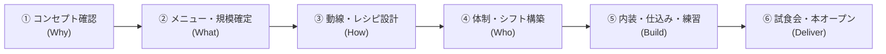
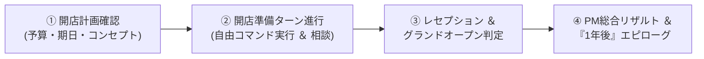

# PM Simulator v3 - カフェ新規オープン編 仕様概要

## 🎯 開発の背景と目的（Why）
**「専門知識がなくても直感的に遊べる『カフェの新規開店プロジェクト』を通じて、正しいプロジェクトマネジメント（PM）の段取り・合意形成・チームマネジメントの重要性を実体験すること」**

### 💡 なぜ「カフェ新規オープン」なのか？
これまでのIT開発テーマでは、「アーキテクチャ」「API」「テストコード」といった専門用語や技術的ディテールに思考が引っ張られ、プレイヤーにとっても開発者にとっても本来のマネジメントの本質（段取り・人間関係・トレードオフ）以外の難易度が高くなっていました。

カフェ（飲食店）の立ち上げは、誰もが直感的にイメージできる身近なテーマでありながら、**PMに必要なすべての要素（Why/What/How/Who/Build/Deliver）とリアルなジレンマが完璧に成立**します。

---

## 📌 コア体験・目指す面白さ

### 1. 「王道の段取り（レシピ・動線）」による成功の気持ちよさ
* 焦って食材を買い込んだり内装工事を急がず、コンセプト・レシピ・動線設計をしっかり整えることで、プレオープンや本番で驚くほどスムーズにお店が回る達成感を味わえる。

### 2. 「専門知識ゼロ」で直感的に状況がわかるシステム
* IT用語を完全に排除。「動線設計」「調理レシピ」「保健所の許可」といった誰もが知っている言葉で、プロジェクトの土台とリスクを可視化。

### 3. 「チーフ（現場リーダー）との相談」による人間的な状況把握
* 単なるパーセンテージ（数値）を見るだけでなく、厨房を仕切る頑固なチーフ料理長との対話を通じて「今何が足りていて、どこに無理があるか」の肌感覚を掴んで判断する。

### 4. 「オーナーのちゃぶ台返し」と「保健所の壁」への先手対策
* 口うるさいオーナーにこまめに進捗を共有して「合意（サイン）」を取り付けたり、工事前に保健所へ事前相談に行くなど、PM必須のステークホルダーマネジメントを体験。

### 5. 「自由な意思決定（フェーズ非固定）」による納得の失敗と学び
* システムがフェーズを強制せず、**最初からすべてのPMコマンドが実行可能**。
* 段取りを飛ばして「いきなり内装工事」や「大量の仕入れ」をして大赤字・やり直しになるという、リアルな失敗からの学びが得られる。

---

## 📖 専門用語を使わない「PM概念」対応表

| PM / ITの概念 | カフェオープンでの表現 | 意味・役割（なぜ大切か） |
| :--- | :--- | :--- |
| **アーキテクチャ / 基礎設計** | **厨房・客席の動線レイアウト** | 配膳動線やコンロ位置。これが悪いと料理が出せず後から大改装 |
| **API / データ仕様** | **調理レシピ ＆ マニュアル** | 誰が作っても同じ味・時間で出せる約束事。ないと味とオペが崩壊 |
| **スコープ定義** | **メニュー数 ＆ 客席規模** | やること・やらないことの線引き。多すぎると仕込みがパンクする |
| **非機能要件 / レギュレーション** | **保健所・消防の営業許可基準** | 衛生・防災ルール。無視するとオープン当日に営業停止を食らう |
| **単体・結合テスト** | **オペレーション練習（模擬営業）** | 注文から配膳までの連携確認。ぶっつけ本番だと注文伝票が散乱 |
| **受入テスト / 検収** | **レセプション（関係者試食会）** | オーナーや関係者を招いての最終チェック。合格でオープン決定 |

---

## 👥 登場人物モデル


---

## 📐 PMの標準意思決定ステップ（王道プロセス）



| ステップ | 正しいPMの行動（ベストプラクティス） | 段取りを飛ばした時の失敗結果（アンチパターン） |
| :--- | :--- | :--- |
| **① コンセプト確認 ＆<br/>オーナー合意** | ターゲット客層や予算を明確にし、**オーナーから書面で合意を取り付ける** | 現場だけで進め、完成直前にオーナーから「こんな地味なカフェにする気じゃなかった」と全取っ替え |
| **② メニュー確定 ＆<br/>許可基準確認** | 看板メニューを絞り込み、保健所・消防の設備基準を事前にヒアリング | メニューを増やしすぎて仕込み不能に。保健所ルール無視で手洗い場の追加工事が発生 |
| **③ 動線 ＆ レシピ設計** | 厨房のすれ違い動線と、誰でも作れるレシピマニュアルを完成させる | レシピなしで各自が勘で調理。動線が悪くて厨房内でスタッフが激突 |
| **④ 体制・シフト構築** | 必要人数を算出して採用し、役割分担とトレーニング計画を立てる | 人手不足のまま突入して既存スタッフが過労で退職。役割分担が曖昧で注文が放置される |
| **⑤ 工事・練習推進** | チーフと連携して内装工事を進め、スタッフに模擬注文の練習をさせる | 練習なしで本番を迎え、伝票が紛失・料理提供に40分かかって客が激怒 |
| **⑥ 試食会・本オープン** | 関係者を招いたレセプションで課題を洗い出し、万全の状態でグランドオープン | チェックなしでオープンし、レジが動かない・お皿が足りない大パニックで即日炎上 |

---

## 🖥 ゲーム画面・ダッシュボード設計（司令塔UI）

ダッシュボードはプレイヤー（店長）が毎ターンの状況を把握し、次の一手を下すメイン画面です。
**「常に表示される基幹パラメータ」**と**「プロジェクトの進行（フェーズ）によって変化する動的要素」**で構成されます。

### 1. 常に表示されるパラメータ（常時表示リソース）
* **📅 残り日数 / スケジュール**: 開店予定日までの残り日数、現在の週・曜日
* **💰 予算残高 ＆ 支出状況**: 残り資金（工事費・人件費・仕入れ）
* **⚡ 店長のアクションポイント (AP)**: 本日の残り行動可能回数（例: 3/3）
* **😊 チーム士気 ＆ 疲労度**: チーフおよびスタッフのモチベーション・疲弊状況
* **👔 オーナー信頼度**: 出資者との関係性（低いと突然の要望変更や予算凍結リスク）

### 2. 進行・フェーズによって変化する項目（動的表示要素）
* **🎯 準備状況メーターのフォーカス**:
  * **序盤（構想・設計期）**: コンセプト合意度、メニュー確定度、保健所事前相談
  * **中盤（調達・構築期）**: 動線レイアウト、調理レシピ策定、内装・設備工事、採用充足率
  * **終盤（検証・本番直前期）**: オペレーション習熟度、保健所本検査見込み、試食会（レセプション）準備
* **💬 チーフ料理長の助言・吹き出し**:
  * 現在の段取りの過不足に応じたリアルタイムの進言（例:「レシピがないのに練習しても無駄ですよ」など）
* **⚠️ 発生中のリスク・アラート**:
  * オーナー未報告リスク、手戻り警告、レギュレーション未確認アラートなど

### 画面レイアウトイメージ

```text
┌────────────────────────────────────────────────────────────────────────┐
│ ☕ カフェ開店プロジェクト・ダッシュボード                              │
│                                                                        │
│ 📅 残り 25日 (第5週/月曜) │ 💰 予算: 380万円 │ 😊 士気: 80% │ 👔 信頼: 70% │
├────────────────────────────────────────────────────────────────────────┤
│ 🎯 開店準備の土台（準備状況）:                                         │
│  ・コンセプト合意     : [██████░░░░] 60% (オーナー確認中)              │
│  ・メニュー ＆ 規模   : [████░░░░░░] 40%                               │
│  ・動線レイアウト     : [██░░░░░░░░] 20%                               │
│  ・調理レシピ・マニュアル: [░░░░░░░░░░]  0% (未着手⚠️)                  │
│  ・内装工事 ＆ 機器設置 : [░░░░░░░░░░]  0%                             │
│  ・スタッフ研修・練習 : [░░░░░░░░░░]  0%                               │
│                                                                        │
│ 💬 チーフ料理長（現場リーダー）の助言:                                 │
│ 「動線レイアウトは固まりましたが、まだ『調理レシピ』ができてません。   │
│   今バイトに練習させても、味も手順もバラバラで時間の無駄になりますよ！」│
│                                                                        │
│ ⚡ 店長の今日のアクション (残 AP: 3/3)                                 │
├────────────────────────────────────────────────────────────────────────┤
│ 🎮 店長の意思決定コマンド（常時全開放・自由に選択可能）                │
│                                                                        │
│ 【👔 オーナー・許可】  [オーナー進捗報告]  [追加予算のお願い]  [保健所への事前相談]│
│ 【📝 設計・メニュー】  [メニュー絞り込み]  [厨房・動線レイアウト] [調理レシピ策定]   │
│ 【👥 チーム・体制】    [チーフと状況相談]  [バイト採用・シフト] [差し入れ・面談]   │
│ 【🍳 工事・練習】      [内装・設備工事]    [オペレーション練習] [関係者レセプション]│
└────────────────────────────────────────────────────────────────────────┘
```

---

## 🔄 ゲームのゴール ＆ コアループ（単一プロジェクト完結型）

本作のゴールは、日々の永続的な店舗運営ではなく、**「開店準備期間（約30日）をマネジメントし、無事にグランドオープン＆初期安定化を達成すること」**です。
プレイヤーの操作は「オープンまで」で完結し、準備期間中の段取り・合意形成・チーム配慮の質に応じて、**「1年後どうなったか」のマルチエピローグ**へと結実します。



### 1. 【開始】開店計画確認（プロローグ）
- 納期（オープン日まで約30日）、初期予算（例: 500万円）、オーナーの初期要望、物件状況を確認。

### 2. 【進行】開店準備ターン進行（1日単位 / AP消費制）
- ダッシュボードのメーターやチーフの助言を確認しながら、1日3APを消費してコマンド（合意、設計、工事、採用、練習等）を実行。
- 前提条件（レシピ・動線・合意）の達成度に応じて、工事の進捗速度・練習効果・手戻り発生率が変動。

### 3. 【クライマックス】レセプション ＆ グランドオープン判定
- **段取りが整っている場合**: 注文〜提供がスムーズ、オーナー大満足、初日行列で大成功。
- **段取りを飛ばした場合（アンチパターン）**: レシピなしで提供遅延・チーフ怒号、動線不良で食器破損、保健所手洗器不備で営業自粛など、リアルなトラブルが噴出。

### 4. 【結末】PM総合リザルト ＆「1年後」エピローグ（マルチエンディング）
オープン当日は突貫工事でなんとか乗り切れても、「レシピなし」「動線不良」「スタッフ酷使」などの負債は1年後に店舗崩壊となって跳ね返ってきます。

| エンディング | オープン時の準備状態 | 1年後の結末（エピローグ） | PM評価 |
| :--- | :--- | :--- | :--- |
| **🏆 地域一番の超人気カフェ**<br/>(True Good) | 動線・レシピ・合意・チームケアすべて完璧 | オペレーションが自走し、店長の手を離れてもチーフとスタッフが笑顔で営業。2号店出店へ | **Sランク**<br/>（最高のPM店長） |
| **☕ 繁盛しているが店長依存**<br/>(Normal) | オープンは成功したがレシピ・マニュアル不足 | 客は入るが、レシピ曖昧で店長やチーフが休みなく厨房に入り続ける羽目に。疲弊が限界近い | **Bランク**<br/>（職人止まりのPM） |
| **🌪️ スタッフ全員離職・崩壊**<br/>(Bad 1: チーム崩壊) | 突貫工事・残業連発で士気崩壊のままオープン | オープン直後の過酷な現場に耐えかねて初期スタッフが全員退職。チーフも去り求人広告地獄へ | **Cランク**<br/>（デスマーチPM） |
| **🏚️ ちゃぶ台返しによる閉店**<br/>(Bad 2: 合意不足) | オーナーとの合意を怠り、独断でオープン | 半年後、オーナーが「やっぱりコンセプトが気に入らない」と一方的に別業態へ改装を決定し閉店 | **Dランク**<br/>（独善PM） |
| **🚫 営業停止・大赤字閉店**<br/>(Worst: 法規・予算無視) | 保健所事前相談なし、予算大幅オーバー | 営業許可不備で指導が入り休業。追加工事費用で完全に資金ショートし、3ヶ月で撤退 | **Eランク**<br/>（破綻PM） |
